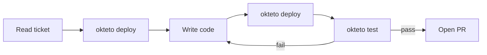

Some tasks don't need a developer in the loop. They need clear requirements, a live environment to test against, and an agent that can iterate until the job is done. In autonomous mode, an agent handles the full lifecycle: deploying an Okteto environment, writing code, running tests against live services, and opening a pull request when everything passes.

This is the basis of a Software Factory. Agents pick up work from tickets or CI triggers, execute against real infrastructure, and deliver tested pull requests. The developer reviews the output, not the process.

## How it works



1. Agent reads the ticket or issue for requirements and acceptance criteria
2. `okteto deploy --wait` to spin up the full environment
3. `okteto endpoints` to capture live URLs
4. Agent makes code changes based on requirements
5. `okteto deploy --wait` to rebuild and redeploy with updated code
6. `okteto test <name>` to run test containers
7. Smoke-test live endpoints (e.g., `curl` against the URLs from step 3)
8. `okteto logs <service> --since 5m` to check for runtime errors
9. If anything fails: fix the code, redeploy, re-test
10. Commit changes and open a pull request

:::warning
`okteto up` is never used in autonomous mode. It's an interactive command that requires a human terminal. Use `okteto deploy` to manage services instead.
:::

## Workflow example: ticket to PR

A CI pipeline or webhook triggers the agent with a ticket:

> Add a `/health` endpoint to the API service that returns database connectivity status and uptime.

The agent deploys the environment, captures the live URLs, then starts coding:

```bash
okteto deploy --wait
okteto endpoints
```

After making the code changes, the agent redeploys and validates:

```bash
# Rebuild and redeploy with the updated code
okteto deploy --wait

# Run tests
okteto test integration

# Smoke-test the new endpoint
curl -s https://api-myns.okteto.example.com/health

# Check logs for errors
okteto logs api --since 5m
```

If the tests or smoke tests fail, the agent reads the error, fixes the code, redeploys, and re-tests. Once everything passes:

```bash
git add -A && git commit -m "Add /health endpoint with db status"
gh pr create --title "Add health endpoint" --body "..."
```

## CLI commands for autonomous agents

| Command | Purpose |
|---------|---------|
| `okteto deploy --wait` | Build images and deploy all services |
| `okteto build <service>` | Rebuild a single service image without redeploying everything |
| `okteto test <name>` | Run a test container defined in `okteto.yaml` |
| `okteto endpoints` | List public URLs for the environment |
| `okteto logs <service>` | View container logs |
| `okteto logs <service> --since 5m` | View recent logs for error checking |

### Commands agents must not run

| Command | Why |
|---------|-----|
| `okteto up` | Interactive. Will hang indefinitely. Not part of the autonomous workflow. |
| `okteto destroy` | Should only run with explicit policy or cleanup automation. |
| `kubectl` / `helm` directly | Bypasses Okteto's resource tracking. Use `okteto deploy` instead. |

## The deploy-test loop

The core pattern in autonomous mode:

1. `okteto deploy --wait` builds any changed images and rolls out the updated services
2. `okteto test <name>` runs validation against the live environment

The agent repeats this loop until all tests pass. Each iteration gives real feedback from a running environment, which is what lets the agent self-correct without human intervention.

If you need to rebuild a single service without redeploying the whole environment, `okteto build <service>` does that. But for most workflows, `okteto deploy --wait` handles both building and deploying in one step.

## Auto-discovery from `okteto.yaml`

The agent reads `okteto.yaml` to understand the project without hardcoded configuration:

- `build` section: which services have images and how to build them
- `deploy` section: how services are deployed
- `test` section: which test containers exist and what commands they run

The agent adapts to whatever `okteto.yaml` defines, so the same workflow works across different projects.

## When to use autonomous mode

This is the Software Factory pattern: agents pick up well-defined tasks and deliver tested results.

- The task has clear, verifiable requirements (e.g., "add endpoint X that returns Y")
- You want ticket-to-PR automation
- The agent is triggered by CI/CD, not by a developer at a terminal
- Batch tasks: writing tests, applying lint fixes, updating dependencies across repos
- You want to review results after the fact via the PR, not during development

For tasks where you want to stay in the loop and iterate with the agent, see [Collaborative Workflows](agentic/collaborative-workflows.mdx).
