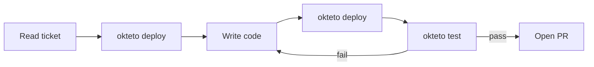

In autonomous mode, an agent handles the full development lifecycle without a developer in the loop: deploying an Okteto environment, writing code, running tests against live services, and opening a pull request when everything passes. This is the basis of a Software Factory, where agents pick up work from tickets or CI triggers, execute against real infrastructure, and deliver tested pull requests. The developer reviews the output, not the process.

## How it works



1. Agent reads the ticket or issue for requirements and acceptance criteria
2. `okteto deploy --wait` to spin up the full environment
3. `okteto endpoints` to capture live URLs
4. Agent makes code changes based on requirements
5. `okteto deploy --wait` to rebuild and redeploy with updated code
6. `okteto test <name>` to run test containers
7. Smoke-test live endpoints (e.g., `curl` against the URLs from step 3)
8. `okteto logs <service> --since 5m` to check for runtime errors
9. If anything fails: fix the code, redeploy, re-test
10. Commit changes and open a pull request

:::warning
`okteto up` is never part of autonomous workflows. It's interactive and requires a human terminal. See [Command rules](agentic/best-practices.mdx#command-rules).
:::

## Agent authentication

For autonomous workflows triggered by CI or webhooks, the agent needs to authenticate with Okteto without a human logging in interactively. Use a [Personal Access Token](core/credentials/personal-access-tokens.mdx) and set the Okteto context before running any commands:

```bash
okteto context use https://okteto.example.com --token $OKTETO_TOKEN
```

Store the token as a secret in your CI system (e.g., a GitHub Actions secret or GitLab CI variable). The agent then has the same CLI access as the token's owner.

## Workflow example: ticket to PR

A CI pipeline or webhook triggers the agent with a ticket:

> Add a `/health` endpoint to the API service that returns database connectivity status and uptime.

The agent deploys the environment, captures the live URLs, then starts coding:

```bash
okteto deploy --wait
okteto endpoints
```

After making the code changes, the agent redeploys and validates:

```bash
# Rebuild and redeploy with the updated code
okteto deploy --wait

# Run tests
okteto test integration

# Smoke-test the new endpoint
curl -s https://api-myns.okteto.example.com/health

# Check logs for errors
okteto logs api --since 5m
```

If the tests or smoke tests fail, the agent reads the error, fixes the code, redeploys, and re-tests. Once everything passes:

```bash
git add src/api/health.ts src/api/routes.ts && git commit -m "Add /health endpoint with db status"
gh pr create --title "Add health endpoint" --body "..."
```

## The deploy-test loop

The core pattern in autonomous mode:

1. `okteto deploy --wait` builds any changed images and rolls out the updated services
2. `okteto test <name>` runs validation against the live environment

The agent repeats this loop until all tests pass. Each iteration gives real feedback from a running environment, which is what lets the agent self-correct without human intervention.

If you need to rebuild a single service without redeploying the whole environment, `okteto build <service>` does that. But for most workflows, `okteto deploy --wait` handles both building and deploying in one step.

The full list of commands agents may and may not run is in [Command rules](agentic/best-practices.mdx#command-rules). For flag details on any command, see the [CLI Reference](reference/okteto-cli.mdx).

## Next steps

- [Collaborative Workflows](agentic/collaborative-workflows.mdx) — stay in the loop and iterate with the agent
- [Best Practices](agentic/best-practices.mdx) — command rules and common pitfalls
