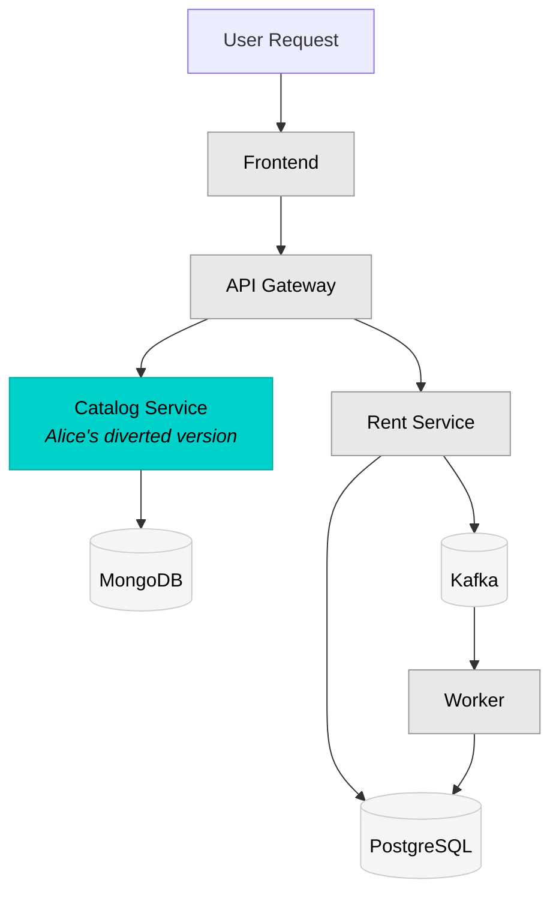

import Image from "@theme/Image";

Divert is Okteto's traffic routing system for developing subsets of microservice applications. Instead of spinning up a complete copy of your application stack for each developer, Divert lets you deploy only the services you're actively modifying while connecting to stable, shared versions of everything else.

With Divert, you can:

- **Deploy only what you change**: Work on 1-2 services instead of managing 20+
- **Get shareable preview URLs**: Receive real URLs others can access to test your work-in-progress
- **Start developing in seconds**: Skip waiting for databases, message queues, and third-party services to initialize
- **Collaborate without conflicts**: Multiple developers work on different services simultaneously
- **Reduce infrastructure costs**: Share expensive resources like databases and message queues across your team
- **Test against real services**: No more mocks or stubs for services you're not modifying

## Setting Up Divert

Setting up Divert involves three roles: an Admin configures the driver once per cluster, a platform or application team maintains a shared environment, and each developer configures their own `okteto.yaml`.

### Prerequisites

**For Admins:**

- Okteto Self-Hosted installation
- Cluster admin access via `kubectl` and Helm 3.x
- A driver decision: nginx (default, requires Linkerd) or istio (if your cluster already runs Istio)

**For Developers:**

- Access to an Okteto instance with Divert enabled
- [Okteto CLI](../get-started/install-okteto-cli.mdx) installed
- A Git repository with your application's `okteto.yaml`

**Application requirements:**

- A microservice architecture with multiple services
- Services that can propagate HTTP headers to downstream calls
- A stable, complete deployment to serve as the shared environment

### Step 1: Configure the Driver (Admin)

The nginx driver is the default and requires Linkerd. Install Linkerd and enable Divert in your Okteto Helm values following the [Linkerd installation guide](../self-hosted/install/divert/linkerd-installation.mdx). Without Linkerd, only the most basic scenario works (a diverted service reached directly through its own endpoint), and service-to-service calls from the shared environment never reach your diverted services.

If your cluster already runs Istio, configure the istio driver instead following the [Istio installation guide](../self-hosted/install/divert/istio-installation.mdx).

See [Configure Divert](../self-hosted/install/divert/index.mdx) for the differences between the two drivers.

### Step 2: Create the Shared Environment

Deploy a complete, stable copy of your application to a shared Namespace (for example, `staging`). All developers' diverted environments fall back to this environment for the services they don't deploy. See [Setting Up Shared Environments](#setting-up-shared-environments) for namespace options and database patterns.

### Step 3: Configure Your Application (Developer)

Update your `okteto.yaml` to deploy only the services you're changing and point Divert at the shared environment:

```yaml
build:
  frontend:
    context: ./frontend

deploy:
  commands:
    # Deploy only the service(s) you're modifying
    - helm upgrade --install frontend ./charts/frontend
        --set image=${OKTETO_BUILD_FRONTEND_IMAGE}

  # Enable Divert and point to the shared environment
  divert:
    driver: nginx # or 'istio' if your cluster uses the istio driver
    namespace: staging
```

Your services must also propagate the `baggage` header to downstream calls. See [Header Propagation Requirement](#header-propagation-requirement) for code examples.

### Step 4: Deploy and Verify

Run `okteto deploy`. Okteto deploys your modified services, creates public endpoints in your namespace that inject the routing header, and gives you a unique URL such as `https://frontend-alice-myapp.okteto.example.com`. Okteto also creates endpoints in your namespace for every public endpoint of the shared environment you did not deploy, so the whole application is reachable under your namespace's URLs.

To verify routing, compare the response from your URL with the shared environment's URL, and confirm that calls to services you didn't deploy reach the shared Namespace. The [Divert tutorial](/docs/tutorials/divert) walks through this flow with a sample application, and [Using Divert](../development/using-divert.mdx) covers implementation patterns in detail.

## How Divert Works

Divert creates lightweight development environments containing only your modified services, then routes traffic between your services and shared infrastructure based on HTTP headers.

### The Divert Flow

1. A shared environment runs the complete application stack (e.g., in a `staging` namespace)
2. You create a personal Development Environment deploying only the service(s) you're modifying
3. Divert automatically routes traffic:
   - Requests with your namespace header → Your version of the service
   - Requests to services you haven't deployed → Shared versions in the staging namespace
   - Databases and queues → Either the shared instances, or your own copies deployed in your namespace (see [Infrastructure Configuration Options](#infrastructure-configuration-options))
4. Your application works normally, unaware it's communicating with services across namespaces

### Shared environment requirements

The shared environment must run in an Okteto-managed Namespace — a Namespace that Okteto deployed, such as with [`okteto deploy`](../get-started/deploy-your-app/deploy.mdx) or a [Preview Environment](../previews/index.mdx). Divert routes traffic to the services in the shared Namespace and, depending on the driver, reads or modifies their ingresses or Istio VirtualServices. Okteto performs these operations with your Okteto credentials, so it needs to manage that Namespace.

Pointing Divert at a Namespace that Okteto did not deploy — for example, an existing `core` namespace you manage yourself — is not officially supported. If your shared services run in a Namespace outside Okteto, redeploy or duplicate them into an Okteto-managed Namespace and set `divert.namespace` to that Namespace.

### Traffic Routing Mechanism

Divert uses the [W3C Trace Context standard `baggage` header](https://www.w3.org/TR/baggage/) for routing decisions:

```
baggage: okteto-divert=alice-feature
```

This header:

- Routes traffic to your diverted services when they exist
- Falls back to shared services automatically
- Propagates through your entire application call chain when properly instrumented

### Architecture Example

Consider the [Movies application](https://github.com/okteto-community/movies-with-divert) used in the Divert samples. The frontend only talks to the API gateway, and the API gateway calls the catalog and rent services. Alice is working on the catalog service and only needs to deploy that service:



**Key Points:**
- **Alice's services** (teal): Only the catalog service is deployed in her namespace
- **Shared services** (gray): Frontend, API gateway, rent service, and worker run in staging
- **Shared infrastructure** (gray): Databases and message queues run in staging

When a request carrying `baggage: okteto-divert=alice` reaches the shared API gateway (for example, through the endpoints Okteto creates in Alice's namespace), the gateway propagates the header and Linkerd routes the catalog call to Alice's version. Requests without the header, or for services Alice didn't deploy, stay in staging. Alice doesn't need to deploy or manage the frontend, API gateway, rent service, worker, MongoDB, PostgreSQL, or Kafka.

## Setting Up Shared Environments

For Divert to work effectively, you need a shared namespace containing a complete, stable deployment of your application. This serves as the "baseline" environment that all developers' diverted namespaces will fall back to.

### Creating the Shared Namespace

You have two options for creating shared namespaces:

1. **Global Preview Environment** (recommended for most teams)
   - Created via Okteto's [Preview Environment](../previews/index.mdx) system, either manually with `okteto preview deploy` or automatically from CI (for example, with Okteto's [GitHub Actions](../previews/using-github-actions.mdx))
   - Global previews are visible to every user in the Okteto instance, so no extra sharing step is needed
   - With the nginx driver, pass `--label=okteto-shared` so Okteto enables Linkerd sidecar injection in the namespace before the deploy runs

2. **Regular Namespace**
   - Standard Okteto Namespace deployed manually or from CI
   - Must be shared explicitly with every developer who will divert from it
   - With the nginx driver, annotate the namespace with `linkerd.io/inject=enabled` before deploying (see the [Linkerd installation guide](../self-hosted/install/divert/linkerd-installation.mdx#enable-sidecar-injection-in-shared-environments))

:::info Access Requirements
Access requirements depend on the driver:

- **nginx driver**: developers need **read access** to the shared namespace so the CLI can copy its endpoints and services. Okteto's own service account needs write access to the shared namespace to create the `HTTPRoute` resources that route traffic.
- **istio driver**: developers need **write access** to the VirtualServices in the shared namespace, because the CLI modifies them to add the header-based routing rules.
:::

### Infrastructure Configuration Options

Divert routes HTTP traffic. It does not split databases or message queues for you, so you have to decide for each diverted service whether it uses the shared instances or its own. Both patterns are supported, and the safe default is isolation: if the service you are working on writes to a database or consumes from a queue, deploy your own copy. A bad write or a consumed message affects everyone using the shared environment.

#### Option 1: Shared Infrastructure

Databases and queues remain in the shared namespace, accessed by all developers:

```yaml
# In shared namespace (e.g., staging)
deploy:
  commands:
    - helm upgrade --install postgresql bitnami/postgresql
    - helm upgrade --install kafka bitnami/kafka
    - helm upgrade --install frontend chart/ --set image=${FRONTEND_IMAGE}
    - helm upgrade --install api chart/ --set image=${API_IMAGE}
```

**Benefits:**
- Shared test data across all developers
- Lower resource usage per developer
- Simpler configuration

**Implications:**
- Every write from a diverted service lands in the shared data. A bug or a test run can corrupt data for the whole team
- Schema migrations run against the shared database and can break the shared environment
- A diverted consumer can take messages from a shared queue that were meant for the shared environment

**Use when:**
- The service you are working on only reads from the database
- Test data can be shared
- You want minimal resource overhead

#### Option 2: Isolated Databases and Queues (Per Developer)

Each developer deploys their own database or queue instances in their personal namespace:

```yaml
# In developer namespace (e.g., alice-feature)
dependencies:
  postgresql:
    repository: https://github.com/okteto/postgresql
    wait: true

deploy:
  commands:
    # Deploy local database
    - helm upgrade --install postgresql bitnami/postgresql
    # Deploy only services you're modifying
    - helm upgrade --install api chart/ --set image=${OKTETO_BUILD_API_IMAGE}
  divert:
    namespace: staging
```

**Benefits:**
- Full control over test data
- Schema changes and writes don't affect other developers
- [Volume Snapshots](use-volume-snapshots.mdx) let you clone the shared database into your namespace in seconds instead of seeding it from scratch

**Implications:**
- Higher resource usage per developer
- Your data drifts from the shared environment unless you refresh it (Volume Snapshots make this cheap)

**Use when:**
- The service you are working on writes to the database or consumes from a queue
- Testing database migrations
- You need isolated test data
- Working with sensitive data

:::tip Hybrid Approach
You can mix both patterns: share stable databases your service only reads from (e.g., user accounts) while running isolated databases for services under active development (e.g., new feature schemas). See [Using Divert](../development/using-divert.mdx#database-isolation-patterns) for manifest examples of each pattern.
:::

### Linkerd Configuration for Shared Namespaces

With the nginx driver, Linkerd sidecar injection must be enabled in the **shared namespace only**:

- Every pod in the shared namespace needs a Linkerd sidecar. The sidecar is what routes a service-to-service call to a diverted version when the header matches
- Developer namespaces must **not** have sidecar injection enabled. Okteto configures diverted pods to fall back to the shared namespace through DNS, so they don't need proxies
- Creating the shared environment with `okteto preview deploy --label=okteto-shared` enables injection automatically. For a regular namespace, annotate it before deploying

See the [Linkerd installation guide](../self-hosted/install/divert/linkerd-installation.mdx#enable-sidecar-injection-in-shared-environments) for setup instructions.

### Verifying Your Shared Environment

Before developers start using Divert, verify your shared namespace is correctly configured:

1. **Check all services are running:**
   ```bash
   kubectl get pods -n staging
   ```

2. **Verify Linkerd sidecars (nginx driver):**
   ```bash
   kubectl get pods -n staging -o jsonpath='{range .items[*]}{.metadata.name}{"\t"}{.spec.containers[*].name}{"\n"}{end}'
   ```
   Each pod should show both application and `linkerd-proxy` containers

3. **Test service connectivity:**
   ```bash
   kubectl exec -n staging deployment/frontend -- curl http://api-service/health
   ```

4. **Confirm the public endpoint is accessible:**
   ```bash
   curl https://staging-yourapp.okteto.example.com
   ```

## Divert Drivers

Okteto supports two implementations of Divert to accommodate different infrastructure setups:

| Driver | Use Case | Requirements |
|--------|----------|--------------|
| **nginx** (default) | Standard Okteto installations | Requires Linkerd. Uses Okteto's built-in nginx ingress for public endpoints and Linkerd for service-to-service routing |
| **istio** | Environments with existing Istio service mesh | Requires Istio installation (non-default Okteto configuration) |

Both drivers provide the same developer experience and use the same `okteto.yaml` configuration. The difference is in the underlying routing technology.

:::info
Both drivers now use the same baggage header format: `baggage: okteto-divert=<namespace>`. This was unified in Okteto 1.31+ for consistency.
:::

### Driver Selection Guide

**Choose nginx driver (default) when:**
- Using standard Okteto installation
- Your cluster does not run Istio
- You can install Linkerd in the cluster

**Choose istio driver when:**
- Your cluster already has Istio installed
- You prefer Istio's VirtualService-based routing
- Your team is familiar with Istio configuration

:::tip
**Istio vs Linkerd**: These serve different purposes. **Istio is a divert driver** (alternative to nginx), while **Linkerd is required by the nginx driver** for service-to-service routing. You cannot use both Istio driver and Linkerd together. See the [admin configuration guide](../self-hosted/install/divert/index.mdx) for details.
:::

## Services to Share

Divert works best when you share stable, resource-intensive services that developers rarely modify directly.

### Commonly Shared Services

| Service Type | Why Share It | Examples |
|--------------|--------------|----------|
| **Databases** | Expensive, slow to initialize, stable schemas | PostgreSQL, MongoDB, Redis, MySQL |
| **Message Queues** | Complex setup, shared infrastructure | Kafka, RabbitMQ, SQS, Redis Pub/Sub |
| **Third-party APIs** | External dependencies, no local version | Payment gateways, auth providers, email services |
| **Legacy Services** | Rarely modified, complex to run | Mainframe connectors, monoliths |
| **ML/AI Models** | Resource-intensive, stable interfaces | Recommendation engines, NLP services |
| **Object Storage** | Shared test data, binary assets | S3, MinIO, Azure Blob Storage |

## Real Team Scenario

Consider a team working on the Movies application:

| Developer | Task | Diverted Services | Shared Services |
|-----------|------|-------------------|-----------------|
| **Alice** | New UI for movie cards | frontend | catalog, api, rent, worker, all databases |
| **Bob** | Add discount logic | rent, worker | frontend, catalog, api, all databases |
| **Carla** | Rental history API | api | frontend, catalog, rent, worker, all databases |
| **David** | Performance testing | catalog | frontend, api, rent, worker, all databases |

All four developers work simultaneously without conflicts:

- They share expensive infrastructure (databases, Kafka)
- Each has isolated versions of services they're modifying
- Changes don't affect other developers
- Testing happens against real services, not mocks

## Resource Comparison

### Without Divert (per developer)

- 5+ application services
- 3+ databases/queues
- ~4GB RAM and 2 CPU cores minimum
- 5-10 minutes to spin up everything
- Full infrastructure cost per person

### With Divert (per developer)

- 1-2 services they're actually modifying
- ~500MB RAM and 0.5 CPU cores
- 10-30 seconds to start developing
- Access to real shared data and services
- **~80% reduction in infrastructure costs**

## Header Propagation Requirement

For Divert to work across service boundaries, your services must propagate the `baggage` header to downstream calls. This ensures that when Service A calls Service B, the routing header travels with the request.

`baggage` is the [W3C standard header](https://www.w3.org/TR/baggage/) for propagating context between services, the same one used by distributed tracing. Most languages already have libraries that propagate it for you, such as the [OpenTelemetry](https://opentelemetry.io/docs/concepts/context-propagation/) instrumentation for HTTP clients and servers. If your services already use OpenTelemetry or a tracing library that supports W3C context propagation, you likely don't need to write any propagation code. The examples below show what the propagation looks like if you implement it by hand.

### Propagation Pattern

```
User Request (with baggage header)
    │
    ▼
Frontend (reads header, includes in API calls)
    │
    ▼
API Service (reads header, includes in database/queue calls)
    │
    ▼
Backend Services (reads header, includes in further calls)
```

### Example Implementations

**JavaScript/Node.js:**
```javascript
// Extract from incoming request
const baggage = req.headers['baggage'];

// Include in outgoing requests
fetch('http://catalog-service/api/movies', {
  headers: { 'baggage': baggage }
});
```

**Go:**
```go
// Extract from incoming request
baggage := r.Header.Get("baggage")

// Include in outgoing requests
req, _ := http.NewRequest("GET", "http://catalog-service/api/movies", nil)
req.Header.Set("baggage", baggage)
```

**Java/Spring:**
```java
// Extract from incoming request
@GetMapping("/api/movies")
public Mono<Movies> getMovies(@RequestHeader(value = "baggage", required = false) String baggage) {
    // Include in outgoing requests using Spring's WebClient
    return webClient.get()
        .uri("http://catalog-service/api/movies")
        .header("baggage", baggage != null ? baggage : "")
        .retrieve()
        .bodyToMono(Movies.class);
}
```

:::tip
Beyond HTTP routing, the baggage header can also be used to route messages to different queues/topics, redirect requests to services in other namespaces, and dynamically select database instances. See the [implementation guide](../development/using-divert.mdx) for detailed patterns.
:::

## Troubleshooting

Troubleshooting guidance lives with the audience it serves:

- [Using Divert](../development/using-divert.mdx#troubleshooting) covers developer-facing issues: header propagation, routing verification, and shared service connectivity.
- [Configure Divert](../self-hosted/install/divert/index.mdx#troubleshooting) covers Admin-facing issues: driver configuration, ingress controllers, and sidecar injection.
- [Linkerd installation](../self-hosted/install/divert/linkerd-installation.mdx#troubleshooting) covers Linkerd-specific issues.

## Next Steps

- **[Using Divert](../development/using-divert.mdx)** - Implementation details, manifest configuration, and code patterns
- **[Divert Tutorial](/docs/tutorials/divert)** - Step-by-step getting started guide
- **[Manifest Reference](../reference/okteto-manifest.mdx#divert)** - Complete configuration options
- **[Self-Hosted Configuration](../self-hosted/install/divert/index.mdx)** - Admin setup for Divert drivers
