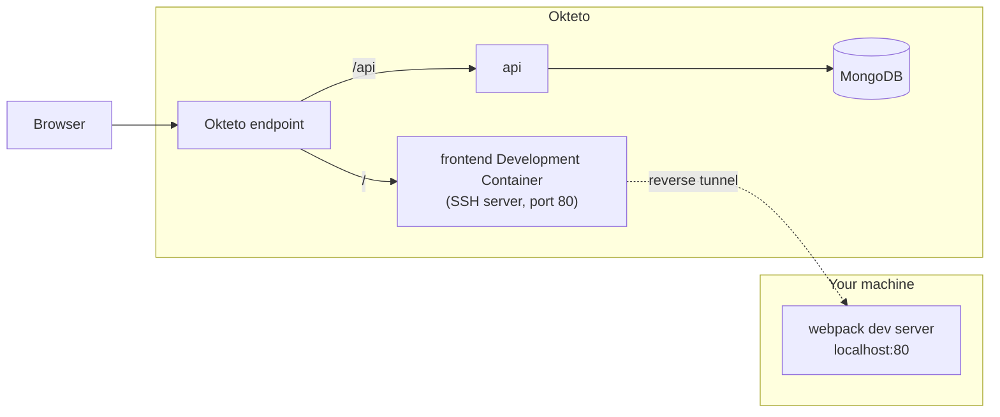

import Image from "@theme/Image";

This guide shows you how to develop a sample frontend application using Okteto Hybrid Mode. The frontend runs on your machine with its own hot-reload server, while the API and database stay in the cluster.

## Prerequisites

- Install the latest version of the Okteto CLI and configure it to access Okteto. [Follow our installation guide](get-started/install-okteto-cli.mdx) if you haven't done so yet.
- Install [Node.js](https://nodejs.org/) and [yarn](https://yarnpkg.com/) on your machine. In Hybrid Mode the frontend runs locally, so its tooling has to be installed locally too.

## Step 1: Deploy the Sample App

Get a local version of the Sample App by executing the following commands:

```bash
git clone https://github.com/okteto/movies-with-helm
cd movies-with-helm
```

Checkout the branch with the Hybrid Mode configuration:

```bash
git checkout hybrid
```

At the root of the directory, you'll find the `okteto.yml` file.
This file describes how to deploy the Sample App.

```yaml title="okteto.yml"
deploy:
  - helm upgrade --install movies chart
```

The Sample App consists of the following services:

- A *React* based front-end, using [webpack](https://webpack.js.org) as bundler and *hot-reload server* for development.
- A very simple Node.js API using [Express](https://expressjs.com).
- A [MongoDB](https://www.mongodb.com) database.

Deploy the Sample App by executing:

```bash
okteto deploy
```

```bash
 i  Using cindy @ okteto.example.com as context
 i  Running 'helm upgrade --install movies chart'
...
 ✓  Development environment 'movies-with-helm' successfully deployed
 i  Endpoints available:
  - https://movies-cindy.okteto.example.dev
  - https://movies-cindy.okteto.example.dev/api
```

Open the first endpoint in your browser to check that the application is running.

## Step 2: Activate your Development Container

The [dev](reference/okteto-manifest.mdx#dev-object-optional) section defines how to activate a Development Container for the Sample App:

```yaml title="okteto.yml"
dev:
  frontend:
    mode: hybrid
    workdir: frontend
    command: bash
    reverse:
      - 80:80
```

The `frontend` key matches the name of the **frontend** Deployment. The definition of the rest of fields are:

- `mode`: to configure Hybrid development mode
- `workdir`: the local directory where `command` runs
- `command`: the command to start the frontend service locally. `bash` opens a shell so you can start the dev server yourself in the next step.
- `reverse`: to expose the local port 80 in the Development Container port 80 using a reverse tunnel. The notation is `remotePort:localPort`.

In Hybrid Mode, the remote Development Container runs an SSH server instead of the frontend code. The Okteto endpoint keeps routing `/` to that container, and the reverse tunnel carries the traffic to your machine:



Next, execute the following command to activate your Development Container:

```bash
okteto up frontend
```

```bash
 i  Using cindy @ okteto.example.com as context
 i  'movies-with-helm' was already deployed. To redeploy run 'okteto deploy' or 'okteto up --deploy'
 ✓  Reverse tunnel configured
    Context:   okteto.example.com
    Namespace: cindy
    Name:      frontend
    Reverse:   80 <- 80

bash-3.2$
```

The Okteto CLI opens a local shell in the `frontend` directory. The shell has the [environment variables](development/containers/hybrid/index.mdx) of the remote `frontend` container injected, so your local process sees the same configuration as the one running in the cluster.

## Step 3: Start the frontend locally

In the shell opened by `okteto up`, install the dependencies and start the webpack dev server:

```bash
yarn install
yarn start
```

The dev server listens on port 80 with hot module replacement enabled. Open the Okteto endpoint in your browser (for example, `https://movies-cindy.okteto.example.dev`). The request reaches the Development Container in the cluster, and the reverse tunnel forwards it to the dev server running on your machine. Requests to `/api` go straight to the API service in the cluster, so the frontend works without any change to its configuration.

:::note
The dev server binds port 80. On Linux, binding ports below 1024 requires elevated privileges. Run `yarn start` with `sudo`, or grant the `CAP_NET_BIND_SERVICE` capability to your Node.js binary.
:::

## Step 4: Develop with hot reload

Open the `frontend/src` directory in your IDE and edit a component, for example a heading or a style. The webpack dev server runs on your machine, so the change shows up in the browser through hot module replacement, with no file synchronization involved. You get the same feedback loop as fully local development, while the frontend talks to the API and database running in the cluster.

## Step 5: Deactivate your Development Container

Press `Ctrl+C` in the terminal to stop the dev server and exit the `okteto up` session. This does not restore the original `frontend` Deployment. To do that, run:

```bash
okteto down frontend
```

You can also set the [`OKTETO_AUTO_DOWN_ENABLED`](reference/feature-flags.mdx) feature flag to run `okteto down` automatically when the session ends.
