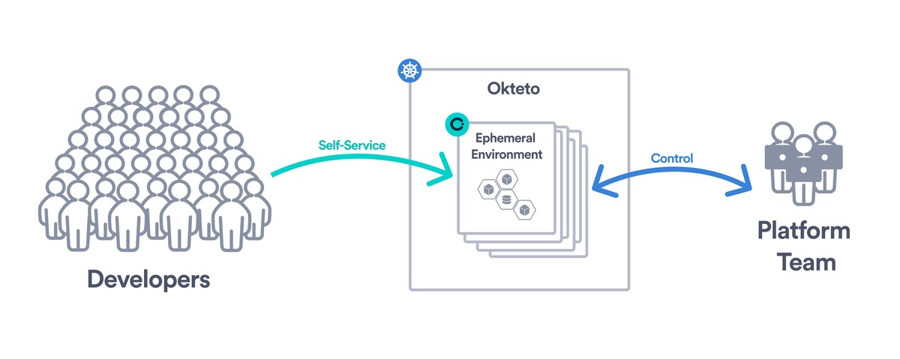
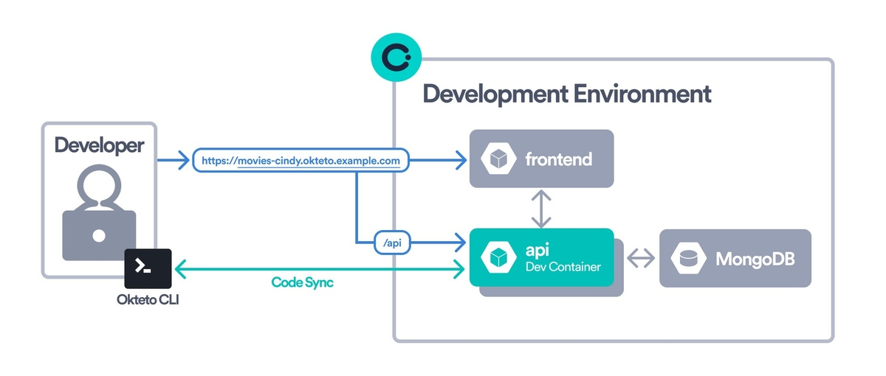
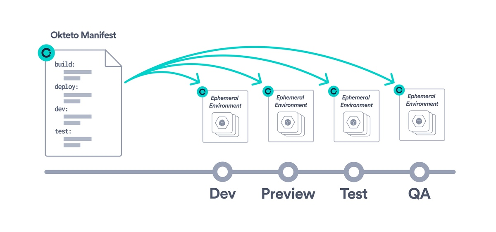

## The environment platform for agentic development

Okteto gives every task, whether it's run by an AI agent or a developer, an isolated, production-like environment on your own infrastructure. Agents and developers build, run, and test their changes against real services and data, so the work is verified before a human reviews it. Platform teams stay in control with resource limits, governance, and observability across every environment.

These docs explain how to install Okteto, run agent and development environments, add Preview Environments to your pull requests, test inside those environments, and operate the platform on BYOC or Self-Hosted infrastructure.

[Start with our Free Tier (5 seats, 1 year)](https://www.okteto.com/free-trial/)

## Why Platform Teams choose Okteto?

### Control, Governance, and Self-service access
Enable your developers to easily access secure and reproducible ephemeral environments. Okteto abstracts the complexity of Kubernetes, providing developers with a straightforward path from code to deployment, all within the cloud. This means no more wrestling with local setup or inconsistencies between environments.

### Real environments for agents and developers
With Okteto, every development environment is a one-click experience for everyone on the team, human or agent. Code Sync and Live Updates reflect your code changes in your cloud environment as soon as you save, so you test and iterate without rebuilds or redeployments. Agents get the same isolated, production-like environments through the Okteto CLI, so what runs for an agent runs the same for a developer and in production.

### Okteto Manifest simplifies environment automation
Utilize the [Okteto Manifest](core/okteto-manifest.mdx) to define and configure your development environments declaratively. This ensures consistent, reproducible environments across your team, tailored to your projects' needs. Use the [Okteto Catalog](development/deploy/deploy-from-catalog.mdx) to create a collection of ready-to-use development environments for your development team.

## Key features

### AI Agent Environments
Okteto works with the agents you already use, such as Claude Code, Cursor, Codex, and Copilot. Install the Okteto plugin in one command and your agent gets an isolated, production-like environment, driven by the same Okteto CLI and `okteto.yaml` your developers use. Now the agent can deploy code, run tests, and verify its changes against real services and data instead of only reading and writing files locally, so its work is proven before you review it. [Agentic Workflows](agentic/index.mdx) covers the setup and example prompts.

### Development Environments
Okteto's [Development Environments](development/index.mdx) enable you to deploy and develop applications directly in the cloud with a single [CLI command](development/using-okteto-cli.mdx) or click of a button. Write code locally on your machine and view your changes live, deployed in the cloud **as soon as you hit save**! You don't have to spend time configuring anything to do this.

### Okteto Test: Shift Left, Test Fast  
Speed up your feedback loops by running **unit, integration, and end-to-end tests** inside your dev environments. With [Okteto Test](testing/index.mdx), you can catch bugs before they hit CI without waiting for long pipeline runs.

### Automated Preview Environments
Collaborate and share your progress with ease. Okteto's [Preview Environments](previews/index.mdx) automatically generate a unique, shareable version of your application for each pull request, making code reviews, automated end-to-end testing, and stakeholder feedback a breeze.

### Unified management interface
Manage your team's development environments, applications, workflows, and roles all from Okteto's [Admin Dashboard](admin/dashboard.mdx). This central hub provides visibility and control over your team's cloud-native development processes, making management straightforward and efficient.

### Automated Cleanup and Cost Optimization 
Okteto helps you reduce cloud costs without manual effort. The [**Garbage Collector**](admin/cleanup.mdx) scales down idle environments and removes unused resources automatically. The [**Resource Manager**](admin/resource-manager.mdx) adjusts CPU and memory limits based on real usage to avoid overprovisioning. Together, they keep your environments efficient and cost-effective.

---

## Choose How You Deploy Okteto

Okteto is flexible enough to meet your deployment and compliance needs.

- **Bring Your Own Cloud (BYOC)**: We maintain Okteto, you bring the cloud. You get full control of data and workloads, with none of the management overhead\
  [Learn about BYOC](byoc/index.mdx)

- **Self-Hosted**: Install Okteto in your own Kubernetes cluster. Ideal for air-gapped, highly regulated, on-premise environments, or for small teams with Kubernetes expertise\
  [Install Okteto Self-Hosted](get-started/install/index.mdx)

---

## Get Started Today

- 🚀 [Follow the installation guide](get-started/install/index.mdx)
- 🗓️ [Book a demo with our team](https://okteto.com/schedule/)
- 🎁 [Sign up for our Free Tier (5 seats, 1 year)](https://www.okteto.com/free-trial/)

Need help deciding which deployment model or feature fits best? [Contact us](https://okteto.com/schedule/) and we'll walk you through it.
