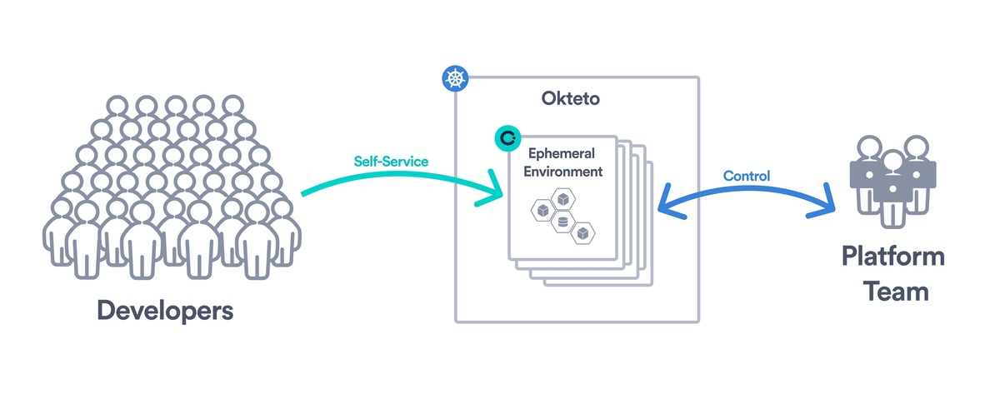
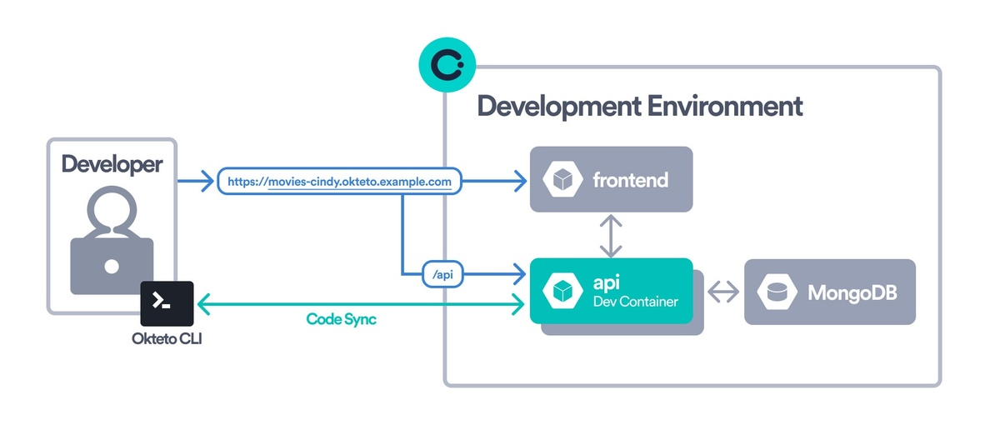
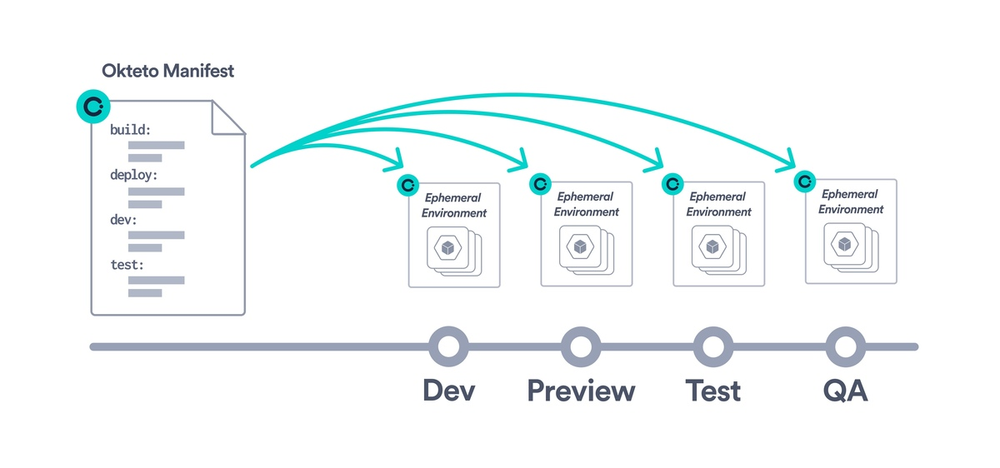

## Build modern development experiences with Okteto
Okteto transforms the way developers code, test, and deploy applications by offering a seamless, cloud-native development experience. Say goodbye to the complexities of setting up local environments and the discrepancies between development and production. With Okteto, you get a powerful platform that emulates your production environment in the cloud, ensuring that you can focus on what you do best: building great applications.

If you haven’t already, get your [free 30-day license key to get started here](https://www.okteto.com/free-trial/)

## Why Platform Teams choose Okteto?
- **Control, Governance, and Self-service access**: Enable your developers to easily access secure and reproducible ephemeral environments. Okteto abstracts the complexity of Kubernetes, providing developers with a straightforward path from code to deployment, all within the cloud. This means no more wrestling with local setup or inconsistencies between environments.

- **Create a seamless development experience**: With Okteto, your development environment is a one-click experience for everyone on the team. Featuring instantaneous Code Sync and Live Updates, experience the magic of seeing your code changes reflected instantly in your cloud environment. This allows for rapid testing and iteration without the need for rebuilds or redeployments, ensuring that your applications run just as smoothly in development as they do in production.

- **Okteto Manifest simplifies environment automation**: Utilize the [Okteto Manifest](core/okteto-manifest.mdx) to define and configure your development environments declaratively. This powerful feature ensures consistent and reproducible environments across your team, tailored to your projects' needs. Use the [Okteto Catalog](development/deploy/deploy-from-catalog.mdx) to create a collection of ready-to-use development environments for your development team.

## Key Features

### Development Environments
Okteto's [Development Environments](development/index.mdx) enable you to deploy and develop applications directly in the cloud with a single [CLI command](development/using-okteto-cli.mdx) or click of a button. Write code locally on your machine and view your changes live, deployed in the cloud **as soon as you hit save**! You don't have to spend time configuring anything to do this.

### Automated Preview Environments
Collaborate and share your progress with ease. Okteto's [Preview Environments](previews/index.mdx) automatically generate a unique, shareable version of your application for each pull request, making code reviews, automated end-to-end testing, and stakeholder feedback a breeze.

### Unified management interface
Manage your team's development environments, applications, workflows, and roles all from Okteto's [Admin Dashboard](admin/dashboard.mdx). This central hub provides visibility and control over your team's cloud-native development processes, making management straightforward and efficient.

## Get Started Today
Jump into our [installation guide](get-started/install/index.mdx) to get started with Okteto. Or [Talk to us](https://okteto.com/schedule/) to let us show you how.

Need a license key? [Sign-up for a free 30-day trial](https://www.okteto.com/free-trial/).