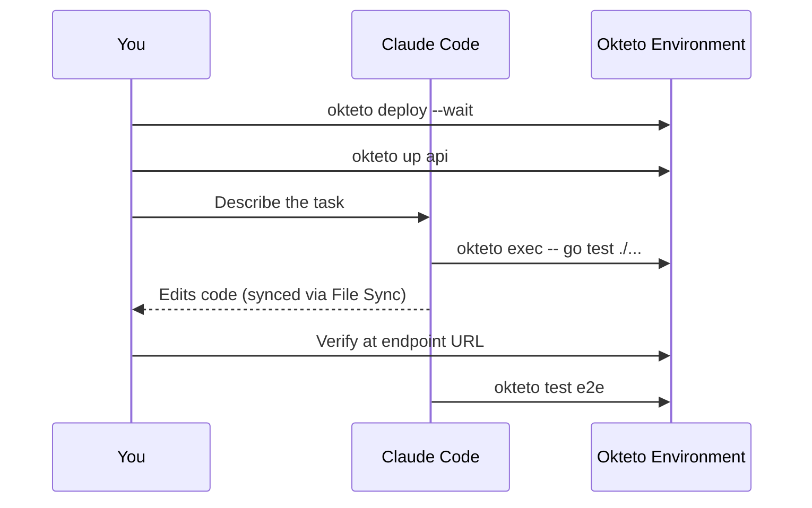

Okteto [Agentic Workflows](/docs/agentic/) let AI agents interact with your Development Environments using the same CLI commands developers use. In collaborative mode, you and an AI agent work in the same Development Environment — you control the dev session while the agent runs commands, edits code, and verifies changes alongside you.

## What you'll build

You and Claude Code will:
1. Deploy the Movies app to an Okteto Development Environment
2. Start a dev session on the API service
3. Use the agent to explore the codebase, make a code change, and run tests
4. Verify the change through File Sync and Okteto Test



## Prerequisites

- Access to an Okteto instance. If you don't have one, follow the [installation guide](/docs/get-started/install/)
- [Okteto CLI](/docs/get-started/install-okteto-cli/) installed and configured with your instance
- [Claude Code](https://claude.ai/code) installed on your machine
- Git installed

## Step 1: Deploy the Movies app

Clone the Movies sample app and deploy it to your Okteto instance:

```console
git clone https://github.com/okteto/movies
cd movies
```

The Movies app is a microservice application with five services:

| Service | Language | Purpose |
|---------|----------|---------|
| `frontend` | React/Node.js | User interface |
| `catalog` | Node.js | Movie catalog (MongoDB) |
| `rent` | Java/Spring Boot | Rental requests (Kafka) |
| `api` | Go | Retrieves rentals (PostgreSQL) |
| `worker` | Go | Processes messages (Kafka → PostgreSQL) |

Deploy the application:

```console
okteto deploy --wait
```

The `--wait` flag blocks until all services are running. You see output similar to:

```console
 i  Using cindy @ okteto.example.com as context
 i  Running 'Deploy Infrastructure (PostgreSQL, Kafka, MongoDB)'
 ...
 i  Running 'Deploy API'
 ✓  Development environment 'movies' deployed
```

Verify your endpoints:

```console
okteto endpoints
```

Open the URL in your browser to confirm the Movies app is running.

## Step 2: Install the Okteto plugin for Claude Code

The Okteto plugin gives Claude Code built-in knowledge of Okteto CLI commands, your [Okteto Manifest](/docs/reference/okteto-manifest) configuration, and the rules for collaborative development — including that the agent must never run `okteto up`.

Open Claude Code in the `movies` directory:

```console
claude
```

Inside Claude Code, install the plugin:

```text
/plugin marketplace add okteto/okteto-claude-plugins
/plugin install okteto
```

Run the `/dev-setup` slash command to verify the plugin is active:

```text
/dev-setup
```

The agent reads your `okteto.yaml` and walks through the environment setup. It discovers the five services, their build targets, Development Containers, and the `e2e` test definition.

## Step 3: Start a dev session

Open a separate terminal in the `movies` directory and start a dev session on the API service:

```console
okteto up api
```

```console
 ✓  Images successfully pulled
 ✓  Files synchronized
    Context:   okteto.example.com
    Namespace: cindy
    Name:      api
    Forward:   2346 -> 2345

okteto>
```

This activates [File Sync](/docs/reference/file-synchronization) and replaces the running API container with a [Development Container](/docs/development/containers/) where you and the agent iterate on code. Leave this terminal open.

:::warning
`okteto up` is an interactive command that requires a human terminal. The agent must never run this command — it hangs indefinitely. You always start the dev session yourself.
:::

## Step 4: Collaborate with the agent

Switch back to the terminal running Claude Code. The agent detects the active dev session on the `api` service. Give it a task — for example, adding a health check endpoint:

```text
Add a /healthz endpoint to the API service that returns HTTP 200
with {"status": "healthy"}. Run the tests to verify nothing is broken.
```

The agent works through the task using Okteto CLI commands:

1. **Explores the codebase** — reads `okteto.yaml` to discover the API service structure, then reads the Go source files in `api/`
2. **Edits the code** — adds the `/healthz` handler to the API
3. **Changes sync automatically** — File Sync propagates edits to the Development Container in seconds, with no rebuild required
4. **Runs tests in the container** — executes `okteto exec -- go test ./...` to verify the change compiles and passes

You see the agent's actions in real time. Intervene at any point to steer the approach — this is the collaborative pattern.

### CLI commands the agent uses

The agent restricts itself to commands that are safe in collaborative mode:

| Command | Purpose |
|---------|---------|
| `okteto exec -- <command>` | Run a command in the active Development Container |
| `okteto logs api` | View API service logs |
| `okteto logs api --since 5m` | View recent logs |
| `okteto test <name>` | Run a test container defined in `okteto.yaml` |
| `okteto endpoints` | List public URLs for the environment |

The agent never runs `okteto up` (interactive, human-only) or `okteto destroy` (destructive).

## Step 5: Verify the change

Confirm the new endpoint works. In the `okteto up` terminal, or ask the agent to run:

```console
okteto exec -- curl -s localhost:8080/healthz
```

Expected output:

```json
{"status": "healthy"}
```

## Step 6: Run end-to-end tests

Stop the dev session to restore the original deployment:

```console
okteto down
```

Rebuild and redeploy the API with your changes:

```console
okteto deploy --wait
```

Run the end-to-end test suite defined in `okteto.yaml`:

```console
okteto test e2e
```

```console
 i  Running test 'e2e'
 ✓  Test container 'e2e' passed
    Artifacts available at: test-results, playwright-report
```

The `e2e` test target builds a Playwright container and runs it against your deployed services, verifying the Movies app works end-to-end.

## Cleanup

Remove the Development Environment when you're done:

```console
okteto destroy
```

## Summary

You deployed the Movies app, installed the Okteto plugin for Claude Code, started a collaborative dev session with `okteto up`, and used the agent to add a feature — with automatic File Sync and verification through Okteto Test.

## Next steps

- [Autonomous Workflows](/docs/agentic/autonomous-workflows) — let the agent handle the full lifecycle from ticket to pull request without a human-controlled dev session
- [Best practices and troubleshooting](/docs/agentic/best-practices) — common patterns and solutions for agentic development
- [Getting started with Okteto Test](/docs/testing/getting-started-test) — configure custom test containers for your own application
