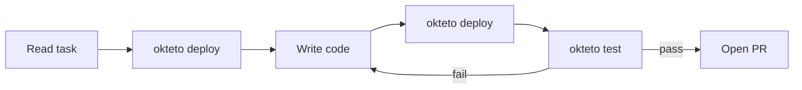

This tutorial walks you through connecting Claude Code to your Okteto environment using the Okteto plugin. You will install the plugin, use collaborative mode to fix a bug with the agent in your IDE, and then use autonomous mode to have the agent deliver a feature end-to-end.

## What you will learn

- How to install the Okteto plugin for Claude Code
- How collaborative mode works: you run `okteto up`, the agent runs commands with `okteto exec`
- How autonomous mode works: the agent handles deploy, code, test, and PR creation
- Which CLI commands agents can and cannot use

## Prerequisites

Before you start, make sure you have:

- Access to an Okteto instance. Otherwise, follow the [installation guide](/docs/get-started/install/index)
- The [Okteto CLI configured](/docs/get-started/install-okteto-cli) with your Okteto instance
- [Claude Code](https://claude.ai/code) installed on your machine
- A project with an `okteto.yaml` file (or use the [Movies sample app](https://github.com/okteto/getting-started))

## Step 1: Install the Okteto plugin

Open Claude Code in your project directory and install the plugin:

```bash
/plugin marketplace add okteto/okteto-claude-plugins
/plugin install okteto
```

This installs the Okteto skill and the `/dev-setup` slash command. The agent now understands which CLI commands to use, which to avoid, and how to discover your project structure from `okteto.yaml`.

Verify the installation by running:

```bash
/dev-setup
```

The agent reads your `okteto.yaml`, deploys the environment with `okteto deploy --wait`, lists available endpoints with `okteto endpoints`, and reports status with suggested next steps.

## Step 2: Clone the sample app

If you don't have an existing project, clone the Movies sample app:

```bash
git clone https://github.com/okteto/getting-started
cd getting-started
git checkout onboarded
```

Deploy it to Okteto:

```bash
okteto deploy
```

## Part A: Collaborative mode

In collaborative mode, you manage the development session while the agent runs commands in your live environment. This is pair-programming with an agent.

### Step 3: Start a dev session

Start a dev session for the API service in your terminal:

```bash
okteto up api
```

:::warning
`okteto up` is an interactive command that requires a human terminal. The agent must never run it — it will hang indefinitely. You always start the dev session yourself.
:::

### Step 4: Ask the agent to investigate a bug

With `okteto up` running, ask the agent to investigate and fix an issue. In Claude Code, type:

```
The /api/watching endpoint returns an empty list even when there
are items in the database. Can you check the logs, investigate
the code, and fix it?
```

The agent works through the problem using your live environment:

1. Checks recent logs:
   ```bash
   okteto logs api --since 10m
   ```

2. Runs the failing test to reproduce:
   ```bash
   okteto exec -- npm test -- --grep "watching"
   ```

3. Reads the source code, identifies the issue, and edits the file locally

4. Because file sync is active, the change appears in the container within seconds — no rebuild needed

5. Re-runs the test to verify:
   ```bash
   okteto exec -- npm test
   ```

### Step 5: Verify the fix

Check the application yourself:

1. Open the endpoint URL from `okteto endpoints` in your browser
2. Verify the watching list displays correctly
3. If satisfied, ask the agent to commit the fix

### Step 6: Stop the dev session

When you're done with collaborative mode:

```bash
okteto down
```

This stops dev mode and restores the original deployment.

### Collaborative mode CLI reference

| Command | Who runs it | Purpose |
|---------|-------------|---------|
| `okteto up <service>` | You | Start the dev session with file sync |
| `okteto exec -- <command>` | Agent | Run commands in the dev container |
| `okteto logs <service>` | Agent | View container logs |
| `okteto test <name>` | Agent | Run a test container |
| `okteto endpoints` | Agent | List public URLs |
| `okteto down` | You | Stop dev mode |

## Part B: Autonomous mode

In autonomous mode, the agent handles the full lifecycle without you managing a dev session. This is the "ticket-to-PR" pattern.

### Step 7: Give the agent a self-contained task

In Claude Code, describe a complete task:

```
Add a /api/health endpoint to the API service that returns JSON
with the server status, current timestamp, and uptime in seconds.
Write a unit test for the endpoint. Deploy, run the tests, verify
the endpoint works, and open a pull request.
```

### Step 8: Watch the agent work

The agent follows this workflow:

1. **Deploy**: `okteto deploy --wait` to bring up the environment
2. **Discover**: Reads `okteto.yaml` to understand services, builds, and tests
3. **Code**: Creates the health endpoint and unit test
4. **Rebuild**: `okteto deploy --wait` to deploy the updated code
5. **Test**: `okteto test api` to run the test containers
6. **Verify**: `curl` against the live endpoint URL from `okteto endpoints`
7. **Check logs**: `okteto logs api --since 5m` to confirm no runtime errors
8. **PR**: Commits changes and opens a pull request

If any step fails, the agent reads the error, fixes the code, and retries the deploy-test loop.



### Step 9: Review the pull request

The agent opens a PR with:
- The code changes
- Test results
- A link to the live preview environment

Review the PR, check the preview URL, and merge when you're satisfied.

### Autonomous mode CLI reference

| Command | Purpose |
|---------|---------|
| `okteto deploy --wait` | Build and deploy all services |
| `okteto build <service>` | Rebuild a single service image |
| `okteto test <name>` | Run a test container |
| `okteto endpoints` | List public URLs |
| `okteto logs <service> --since 5m` | Check for runtime errors |

### Commands agents must never run

| Command | Why |
|---------|-----|
| `okteto up` | Interactive — hangs when run by an agent |
| `okteto destroy` | Tears down the environment — requires explicit authorization |
| `kubectl` / `helm` directly | Bypasses Okteto resource tracking |

## Summary

You installed the Okteto plugin for Claude Code and used two workflow modes:

- **Collaborative mode**: You ran `okteto up` and the agent used `okteto exec` to investigate and fix a bug in a live environment with instant file sync
- **Autonomous mode**: The agent handled deploy, code, test, and PR creation end-to-end using the deploy-test loop

Both modes use the same `okteto.yaml` manifest and CLI commands. The plugin teaches the agent to auto-discover your project structure, so the same workflow works across any Okteto project.

## Next steps

- [Claude Code Plugin reference](/docs/agentic/claude-code-plugin) for plugin configuration details
- [Collaborative Workflows](/docs/agentic/collaborative-workflows) for pair-programming patterns
- [Autonomous Workflows](/docs/agentic/autonomous-workflows) for ticket-to-PR automation
- [Best Practices](/docs/agentic/best-practices) for common pitfalls and how to avoid them
