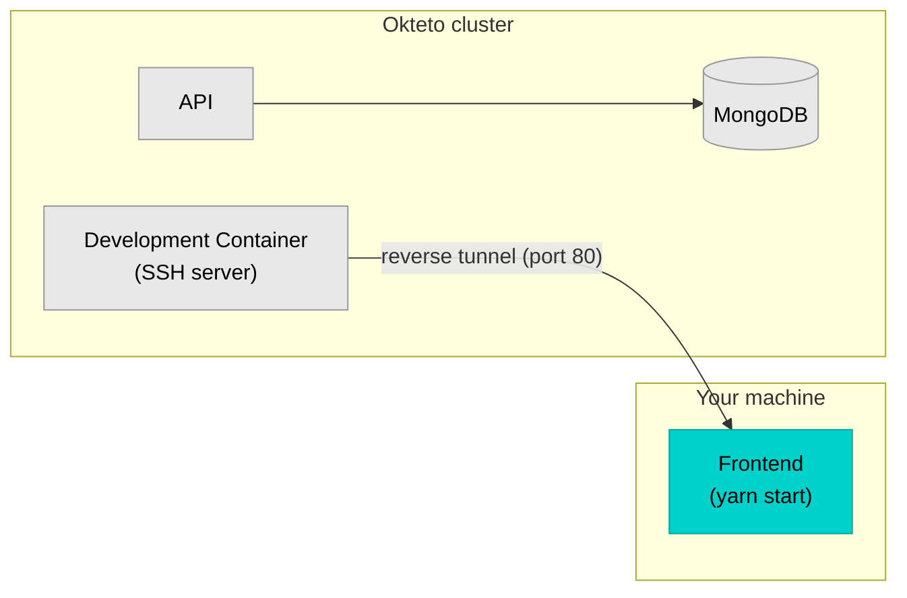

import Image from "@theme/Image";

Hybrid development mode runs your service on your local machine while the rest of your application stays in the cluster. An SSH tunnel connects the two, so cluster services can reach your local process and your local process can reach cluster services.

This is ideal for:

- **Frontend development**: use browser DevTools, local hot reload, and your IDE without file sync delays
- **IDE-heavy workflows**: Java/Spring developers who rely on IDE-managed builds, test runners, and debuggers
- **Native tooling**: any scenario where local execution is faster or more convenient than remote file synchronization



## Prerequisites

- Access to an Okteto instance
- [Okteto CLI](/docs/get-started/install-okteto-cli/) installed and configured
- [Node.js](https://nodejs.org/) and [yarn](https://yarnpkg.com/) installed locally

## Step 1: Deploy the Movies application

Clone the sample application and check out the branch with Hybrid Mode pre-configured:

```console
git clone https://github.com/okteto/movies-with-helm
cd movies-with-helm
git checkout hybrid
```

The application consists of three services:

| Service | Technology | Purpose |
|---------|------------|---------|
| Frontend | React/webpack | User interface |
| API | Node.js/Express | Movie catalog |
| MongoDB | MongoDB | Data storage |

Deploy the application:

```console
okteto deploy
```

```
 i  Using cindy @ okteto.example.com as context
 i  Running 'helm upgrade --install movies chart --set api.image=${OKTETO_BUILD_API_IMAGE} --set frontend.image=${OKTETO_BUILD_FRONTEND_IMAGE}'
...
 ✓  Development environment 'movies-with-helm' successfully deployed
 i  Endpoints available:
  - https://movies-cindy.okteto.example.dev
  - https://movies-cindy.okteto.example.dev/api
```

Open the endpoint URL in your browser to verify the application is running.

## Step 2: Review the hybrid mode configuration

The `okteto.yml` file includes a `dev` section that configures Hybrid Mode for the frontend service:

```yaml title="okteto.yml"
dev:
  frontend:
    mode: hybrid
    workdir: frontend
    command: bash
    reverse:
      - 80:80
```

Each field controls a specific part of the hybrid setup:

- `mode: hybrid` — runs the service locally instead of synchronizing files to a remote container
- `workdir: frontend` — sets the local working directory where the command runs
- `command: bash` — opens a local shell session where you start your dev server
- `reverse: 80:80` — creates a reverse tunnel that exposes your local port 80 on the Development Container's port 80, so the Okteto endpoint and other cluster services can reach your locally running frontend

:::note
In Hybrid Mode, the remote Development Container runs an SSH server instead of your application code. The SSH server provides the tunnel between your local machine and the cluster.
:::

### Hybrid Mode compared to File Sync

| | File Sync (default) | Hybrid Mode |
|---|---|---|
| Code runs in | Remote container | Your local machine |
| File changes via | Bidirectional sync | Local filesystem (no sync needed) |
| Best for | Backend services, polyglot teams | Frontend dev, IDE-heavy workflows |
| Latency | Low (code is in cluster) | Higher (traffic traverses SSH tunnel) |

## Step 3: Activate the Development Container

Start the hybrid Development Environment for the frontend service:

```console
okteto up frontend
```

```
 i  Using cindy @ okteto.example.com as context
 i  Development environment 'movies-with-helm' already deployed.
 ✓  Reverse tunnel configured
    Context:   okteto.example.com
    Namespace: cindy
    Name:      frontend
    Reverse:   80 <- 80

bash-3.2$
```

The Okteto CLI opens a local shell with the environment variables from the remote frontend service injected into the session. The reverse tunnel is active — traffic hitting port 80 on the remote Development Container forwards to port 80 on your local machine.

## Step 4: Start the frontend locally

In the shell session opened by `okteto up`, install dependencies and start the webpack dev server:

```console
yarn install
yarn start
```

The dev server starts on port 80 with hot module replacement enabled. Open the Okteto endpoint URL in your browser (e.g., `https://movies-cindy.okteto.example.dev`).

The request flows through the Okteto endpoint to the Development Container, which tunnels it to your locally running webpack dev server through the reverse port.

## Step 5: Make a code change

Open the frontend source code in your IDE. Edit a component — for example, change a heading or a CSS style in the `frontend/src/` directory. Because the webpack dev server runs locally, changes appear in the browser immediately through hot module replacement. No file synchronization is involved.

This is the key advantage of Hybrid Mode for frontend development: you get the same fast feedback loop as purely local development while your frontend connects to backend services running in the cluster.

## Step 6: Forward cluster services to your local machine

When your local service needs to connect directly to a cluster service (a database, message queue, or another API), use the `forward` field to make the remote service available on `localhost`.

For example, a Java service that connects to Kafka running in the cluster:

```yaml title="okteto.yml"
dev:
  vote:
    mode: hybrid
    command: bash
    workdir: vote
    reverse:
      - 8080:8080
    forward:
      - 9092:kafka:9092
```

- `reverse: 8080:8080` — exposes your local Java service (port 8080) to the cluster
- `forward: 9092:kafka:9092` — maps `localhost:9092` to the cluster's `kafka` service on port 9092

Your local code connects to `localhost:9092` as if Kafka were running on your machine.

:::tip
If your application resolves services by hostname (e.g., `kafka` instead of `localhost`), add an entry to `/etc/hosts` to avoid changing connection strings:
```
127.0.0.1 kafka
```
:::

## Cleanup

Press `Ctrl+C` in the terminal to stop the local process and deactivate the Development Container. The application reverts to its original deployed state.

## Next steps

You've run a frontend service locally while the rest of the application stayed in the cluster.

- Read about [Hybrid Mode architecture](/docs/development/containers/hybrid/) for environment variable handling and supported configuration fields
- Try [Hybrid Mode for Java development](/docs/development/containers/hybrid/hybrid-java) to use IDE debuggers with remote dependencies
- Explore [File Sync mode](/docs/development/containers/file-sync/) for services that run better in a remote container
- Check the [Okteto Manifest reference](/docs/reference/okteto-manifest#dev-object-optional) for all `dev` configuration options
