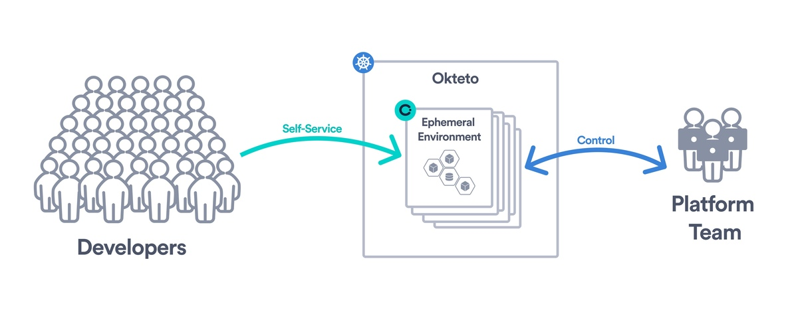
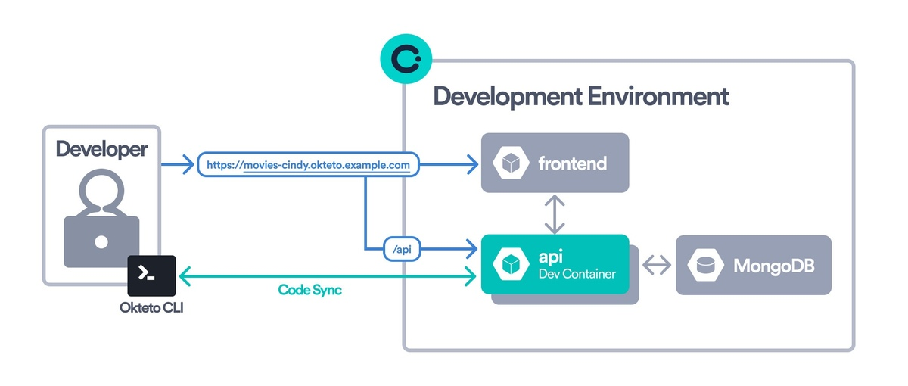
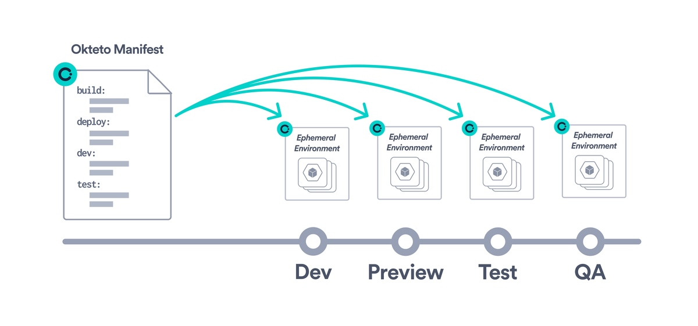

## Build modern development experiences with Okteto
Okteto transforms the way developers code, test, and deploy applications by offering a seamless, cloud-native development experience. Say goodbye to the complexities of setting up local environments and the discrepancies between development and production. With Okteto, you get **ephemeral cloud-based environments**, **instant code sync**, **remote debugging**, and **built-in automations** all designed to improve developer productivity and platform team efficiency.

[Start your 30-day free trial](https://www.okteto.com/free-trial/)

## Why Platform Teams choose Okteto?

### Control, Governance, and Self-service access
Enable your developers to easily access secure and reproducible ephemeral environments. Okteto abstracts the complexity of Kubernetes, providing developers with a straightforward path from code to deployment, all within the cloud. This means no more wrestling with local setup or inconsistencies between environments.

### Create a seamless development experience
With Okteto, your development environment is a one-click experience for everyone on the team. Featuring instantaneous Code Sync and Live Updates, experience the magic of seeing your code changes reflected instantly in your cloud environment. This allows for rapid testing and iteration without the need for rebuilds or redeployments, ensuring that your applications run just as smoothly in development as they do in production.

### Okteto Manifest simplifies environment automation
Utilize the [Okteto Manifest](core/okteto-manifest.mdx) to define and configure your development environments declaratively. This powerful feature ensures consistent and reproducible environments across your team, tailored to your projects' needs. Use the [Okteto Catalog](development/deploy/deploy-from-catalog.mdx) to create a collection of ready-to-use development environments for your development team.

## Key features

### Development Environments
Okteto's [Development Environments](development/index.mdx) enable you to deploy and develop applications directly in the cloud with a single [CLI command](development/using-okteto-cli.mdx) or click of a button. Write code locally on your machine and view your changes live, deployed in the cloud **as soon as you hit save**! You don't have to spend time configuring anything to do this.

### Okteto Test: Shift Left, Test Fast  
Speed up your feedback loops by running **unit, integration, and end-to-end tests** inside your dev environments. With [Okteto Test](testing/index.mdx), you can catch bugs before they hit CI without waiting for long pipeline runs.

### Automated Preview Environments
Collaborate and share your progress with ease. Okteto's [Preview Environments](previews/index.mdx) automatically generate a unique, shareable version of your application for each pull request, making code reviews, automated end-to-end testing, and stakeholder feedback a breeze.

### Unified management interface
Manage your team's development environments, applications, workflows, and roles all from Okteto's [Admin Dashboard](admin/dashboard.mdx). This central hub provides visibility and control over your team's cloud-native development processes, making management straightforward and efficient.

### Automated Cleanup and Cost Optimization 
Okteto helps you reduce cloud costs without manual effort. The [**Garbage Collector**](admin/cleanup.mdx) scales down idle environments and removes unused resources automatically. The [**Resource Manager**](admin/resource-manager.mdx) adjusts CPU and memory limits based on real usage to avoid overprovisioning. Together, they keep your environments efficient and cost-effective.

---

## Choose How You Deploy Okteto

Okteto is flexible enough to meet your deployment and compliance needs.

- **Bring Your Own Cloud (BYOC)**: We maintain Okteto, you bring the cloud. You get full control of data and workloads, with none of the management overhead\
  [Learn about BYOC](byoc/index.mdx)

- **Self-Hosted**: Install Okteto in your own Kubernetes cluster. Ideal for air-gapped, highly regulated, on-premise environments, or for small teams with Kubernetes expertise\
  [Install Okteto Self-Hosted](get-started/install/index.mdx)

---

## Get Started Today

- 🚀 [Follow the installation guide](get-started/install/index.mdx)
- 🗓️ [Book a demo with our team](https://okteto.com/schedule/)
- 🎁 [Claim your free 30-day trial](https://www.okteto.com/free-trial/)

Need help deciding which deployment model or feature fits best? [Contact us](https://okteto.com/schedule/) and we’ll walk you through it.