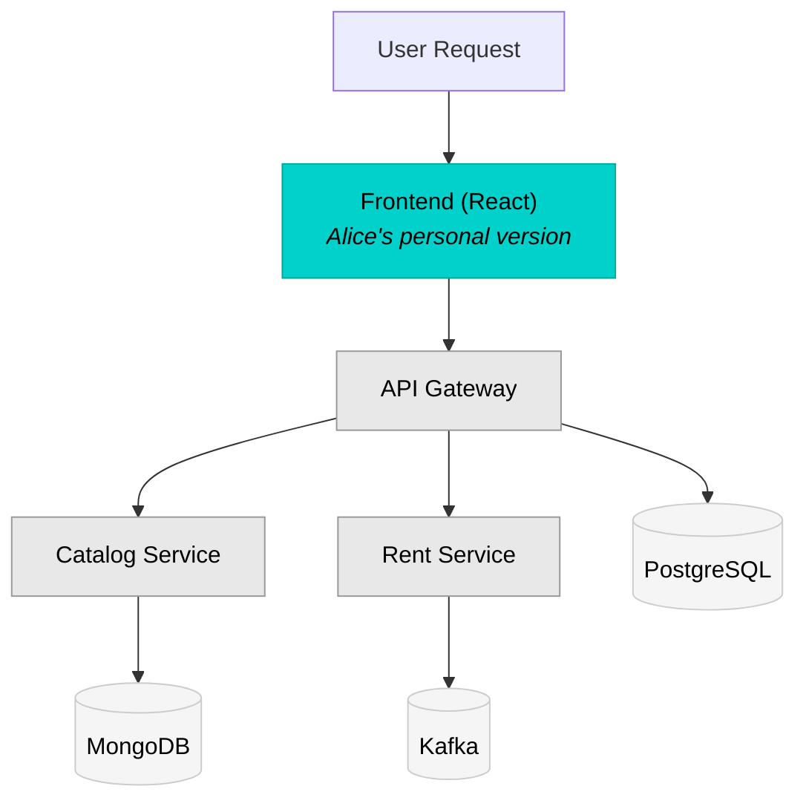

import Image from "@theme/Image";

Divert is Okteto's intelligent traffic routing system that enables developers to work efficiently with subsets of microservice applications. Instead of spinning up complete copies of your entire application stack for each developer, Divert allows you to deploy only the services you're actively modifying while seamlessly connecting to stable, shared versions of everything else.

## What is Divert?

Divert transforms how teams develop microservices by making selective service deployment both practical and transparent to your application code. With Divert, you can:

- **Deploy only what you change**: Work on 1-2 services instead of managing 20+
- **Get shareable preview URLs**: Receive real URLs others can access to test your work-in-progress
- **Start developing in seconds**: Skip waiting for databases, message queues, and third-party services to initialize
- **Collaborate without conflicts**: Multiple developers work on different services simultaneously
- **Reduce infrastructure costs**: Share expensive resources like databases and message queues across your team
- **Test against real services**: No more mocks or stubs for services you're not modifying

## Getting Started with Divert

This section provides a complete end-to-end guide for setting up and using Divert in your organization. Follow these steps in order for a successful implementation.

### Step 1: Prerequisites Check

Before enabling Divert, ensure you have:

**For Administrators:**
- Okteto self-hosted installation (version 1.31+)
- Cluster admin access via `kubectl`
- Helm 3.x installed
- Decision on driver: nginx (default) or istio (if Istio already installed)

**For Developers:**
- Access to an Okteto instance with Divert enabled
- Okteto CLI installed ([installation guide](../get-started/install-okteto-cli.mdx))
- Git repository with your application's `okteto.yaml` manifest

**Application Requirements:**
- Microservice architecture with multiple services
- Services that can propagate HTTP headers to downstream calls
- A stable, complete deployment that can serve as the shared environment

### Step 2: Set Up Shared Environment

Create a shared namespace containing your complete application stack:

```bash
# Option 1: Deploy using Okteto CLI
okteto deploy --namespace staging

# Option 2: Use kubectl/helm directly
kubectl create namespace staging
helm install myapp ./chart --namespace staging
```

**Key considerations:**
- Choose a memorable namespace name (e.g., `staging`, `shared`, `baseline`)
- Deploy all services, databases, and dependencies
- Ensure all services are healthy and accessible
- This environment should be stable and updated regularly

See [Setting Up Shared Environments](#setting-up-shared-environments) for detailed configuration options.

### Step 3: Choose and Configure Driver

**Option A: nginx Driver (Recommended)**

The nginx driver is enabled by default. Install Linkerd for service-to-service routing:

```bash
# 1. Install Linkerd (Administrators only)
curl --proto '=https' --tlsv1.2 -sSfL https://run.linkerd.io/install | sh
linkerd install --crds | kubectl apply -f -
linkerd install | kubectl apply -f -
linkerd check

# 2. Enable Linkerd in Okteto namespaces
# Add to Okteto Helm values:
namespace:
  annotations:
    linkerd.io/inject: enabled
```

**Option B: istio Driver (If Istio Already Installed)**

Configure Okteto to use Istio:

```yaml
# Okteto Helm values
okteto-nginx:
  enabled: false

virtualServices:
  enabled: true

namespace:
  labels:
    istio-injection: enabled
```

See [Self-Hosted Configuration](../self-hosted/install/divert/index.mdx) for complete admin setup.

### Step 4: Configure Your Application

Update your `okteto.yaml` to enable Divert:

```yaml
build:
  frontend:
    context: ./frontend

deploy:
  commands:
    # Deploy only the service(s) you're modifying
    - helm upgrade --install frontend ./charts/frontend
        --set image=${OKTETO_BUILD_FRONTEND_IMAGE}

  # Enable Divert and point to shared environment
  divert:
    driver: nginx  # or 'istio' if using Istio
    namespace: ${OKTETO_SHARED_NAMESPACE:-staging}
```

**Key configuration:**
- `divert.namespace`: Points to your shared environment
- `divert.driver`: Matches your cluster configuration (nginx or istio)
- `deploy.commands`: Only deploy services you're actively changing

### Step 5: Implement Header Propagation

Update your application code to propagate the `baggage` header:

**Example (Node.js/Express):**
```javascript
app.use((req, res, next) => {
  req.baggage = req.headers['baggage'];
  next();
});

// In your service calls
fetch('http://api-service/endpoint', {
  headers: { 'baggage': req.baggage }
});
```

See [Using Divert](../development/using-divert.mdx#header-propagation) for language-specific examples.

### Step 6: Deploy Your First Diverted Environment

Deploy your personal development environment:

```bash
# Deploy with Divert enabled
okteto deploy

# Okteto will:
# 1. Deploy only your modified service(s)
# 2. Create an ingress with header injection
# 3. Provide a unique URL for your environment
```

You'll receive a URL like: `https://frontend-alice-myapp.okteto.example.com`

### Step 7: Verify Divert is Working

Test that traffic routing works correctly:

**1. Check your deployed service:**
```bash
okteto namespace alice-myapp
kubectl get pods
# Should show only your modified service(s), not the full stack
```

**2. Verify sidecar injection (nginx driver):**
```bash
kubectl get pods -o jsonpath='{range .items[*]}{.metadata.name}{"\t"}{.spec.containers[*].name}{"\n"}{end}'
# Should show 'linkerd-proxy' alongside your application container
```

**3. Test routing with the baggage header:**
```bash
# Test your endpoint
curl https://frontend-alice-myapp.okteto.example.com

# Test the shared environment
curl https://frontend-staging-myapp.okteto.example.com

# Verify different responses (yours vs. shared)
```

**4. Check service-to-service routing:**
```bash
# Exec into your pod and test downstream services
kubectl exec -it deployment/frontend -- curl http://api-service/health
# Should successfully reach the shared service
```

### Step 8: Develop and Iterate

With Divert working, you can now:

1. **Make changes** to your service locally
2. **Deploy updates** with `okteto deploy`
3. **Test immediately** using your personal URL
4. **Share with teammates** - they can access your URL to review
5. **Work in parallel** - other developers can work on different services

### Next Steps

- **[How Divert Works](#how-divert-works)** - Deep dive into architecture and routing
- **[Divert Tutorial](/docs/tutorials/divert)** - Hands-on walkthrough with sample app
- **[Using Divert](../development/using-divert.mdx)** - Implementation patterns and best practices
- **[Troubleshooting](#troubleshooting)** - Common issues and solutions

## How Divert Works

Divert creates lightweight development environments containing only your modified services, then intelligently routes traffic between your services and shared infrastructure based on HTTP headers.

### The Divert Flow

1. A shared environment runs the complete application stack (e.g., in a `staging` namespace)
2. You create a personal Development Environment deploying only the service(s) you're modifying
3. Divert automatically routes traffic:
   - Requests with your namespace header → Your version of the service
   - Requests to services you haven't deployed → Shared versions in the staging namespace
   - Database, queue, and external service calls → Shared infrastructure
4. Your application works normally, unaware it's communicating with services across namespaces

### Traffic Routing Mechanism

Divert uses the [W3C Trace Context standard `baggage` header](https://www.w3.org/TR/baggage/) for routing decisions:

```
baggage: okteto-divert=alice-feature
```

This header:

- Routes traffic to your diverted services when they exist
- Falls back to shared services automatically
- Propagates through your entire application call chain when properly instrumented

### Architecture Example

Consider a Movies application with multiple microservices. Alice is working on the frontend and only needs to deploy that service:



**Key Points:**
- **Alice's services** (teal): Only the Frontend is deployed in her namespace
- **Shared services** (gray): Catalog, API Gateway, and Rent Service run in staging
- **Shared infrastructure** (gray): Databases and message queues run in staging

Alice doesn't need to deploy or manage the catalog service, rent service, API gateway, MongoDB, PostgreSQL, or Kafka. Divert handles all the routing transparently.

## Setting Up Shared Environments

For Divert to work effectively, you need a shared namespace containing a complete, stable deployment of your application. This serves as the "baseline" environment that all developers' diverted namespaces will fall back to.

### Shared Namespace Recommendations

**Creating the Shared Namespace:**

You have two primary options for creating shared namespaces:

1. **Global Preview Namespace** (Recommended for most teams)
   - Created via Okteto's preview environment system
   - Automatically managed by Okteto
   - Good for teams with CI/CD pipelines
   - Requires: Configure preview automation in your repository

2. **Regular Namespace**
   - Standard Okteto namespace deployed manually or via CI
   - More control over deployment timing
   - Good for stable staging/demo environments
   - Requires: Manual deployment management

:::info Access Requirements
All developers need **read access** to the shared namespace services for Divert routing to work. Configure namespace permissions to ensure team members can access shared resources without deployment permissions.
:::

### Infrastructure Configuration Options

When setting up your shared environment, you can configure databases and message queues in two ways:

#### Option 1: Shared Infrastructure (Most Common)

Databases and queues remain in the shared namespace, accessed by all developers:

```yaml
# In shared namespace (e.g., staging)
deploy:
  commands:
    - helm upgrade --install postgresql bitnami/postgresql
    - helm upgrade --install kafka bitnami/kafka
    - helm upgrade --install frontend chart/ --set image=${FRONTEND_IMAGE}
    - helm upgrade --install api chart/ --set image=${API_IMAGE}
```

**Benefits:**
- Shared test data across all developers
- Lower resource usage per developer
- Simpler configuration
- Best for stable database schemas

**Use when:**
- Database schemas are stable
- Test data can be shared
- You want minimal resource overhead

#### Option 2: Isolated Databases (Per Developer)

Each developer deploys their own database instances in their personal namespace:

```yaml
# In developer namespace (e.g., alice-feature)
dependencies:
  postgresql:
    repository: https://github.com/okteto/postgresql
    wait: true

deploy:
  commands:
    # Deploy local database
    - helm upgrade --install postgresql bitnami/postgresql
    # Deploy only services you're modifying
    - helm upgrade --install api chart/ --set image=${OKTETO_BUILD_API_IMAGE}
  divert:
    namespace: staging
```

**Benefits:**
- Full control over test data
- Can modify schemas without affecting others
- Great for testing migrations
- Can use [volume snapshots](use-volume-snapshots.mdx) for fast database cloning

**Use when:**
- Testing database migrations
- Need isolated test data
- Schema changes are frequent
- Working with sensitive data

:::tip Hybrid Approach
You can mix both patterns: share stable databases (e.g., user accounts) while running isolated databases for services under active development (e.g., new feature schemas).
:::

### Linkerd Configuration for Shared Namespaces

When using the nginx driver, **Linkerd must be installed and configured** in both your shared namespace and developer namespaces for service-to-service routing to work.

**Key Requirements:**
- Linkerd sidecar injection must be enabled in the shared namespace
- All services in the shared namespace need Linkerd sidecars
- Developer namespaces automatically inherit Linkerd configuration

See the [Linkerd Installation Guide](../self-hosted/install/divert/linkerd-installation.mdx) for detailed setup instructions.

### Verifying Your Shared Environment

Before developers start using Divert, verify your shared namespace is correctly configured:

1. **Check all services are running:**
   ```bash
   kubectl get pods -n staging
   ```

2. **Verify Linkerd sidecars (nginx driver only):**
   ```bash
   kubectl get pods -n staging -o jsonpath='{range .items[*]}{.metadata.name}{"\t"}{.spec.containers[*].name}{"\n"}{end}'
   ```
   Each pod should show both application and `linkerd-proxy` containers

3. **Test service connectivity:**
   ```bash
   kubectl exec -n staging deployment/frontend -- curl http://api-service/health
   ```

4. **Confirm ingress is accessible:**
   ```bash
   curl https://staging-yourapp.okteto.example.com
   ```

## Divert Drivers

Okteto supports two implementations of Divert to accommodate different infrastructure setups:

| Driver | Use Case | Requirements |
|--------|----------|--------------|
| **nginx** (default) | Standard Okteto installations | Uses Okteto's built-in nginx ingress. **Requires Linkerd** for service-to-service routing |
| **istio** | Environments with existing Istio service mesh | Requires Istio installation (non-default Okteto configuration) |

Both drivers provide the same developer experience and use the same `okteto.yaml` configuration. The difference is in the underlying routing technology.

:::info
Both drivers now use the same baggage header format: `baggage: okteto-divert=<namespace>`. This was unified in Okteto 1.31+ for consistency.
:::

### Driver Selection Guide

**Choose nginx driver (default) when:**
- Using standard Okteto installation
- You want the simplest setup
- **Note**: Linkerd is required for service-to-service routing with the nginx driver

**Choose istio driver when:**
- Your cluster already has Istio installed
- You prefer Istio's VirtualService-based routing
- Your team is familiar with Istio configuration

:::tip
**Istio vs Linkerd**: These serve different purposes. **Istio is a divert driver** (alternative to nginx), while **Linkerd is required for the nginx driver** to enable service-to-service routing. You cannot use both Istio driver and Linkerd together. See the [admin configuration guide](../self-hosted/install/divert/index.mdx) for details.
:::

## What Services Should Be Shared?

Divert works best when you share stable, resource-intensive services that developers rarely modify directly.

### Commonly Shared Services

| Service Type | Why Share It | Examples |
|--------------|--------------|----------|
| **Databases** | Expensive, slow to initialize, stable schemas | PostgreSQL, MongoDB, Redis, MySQL |
| **Message Queues** | Complex setup, shared infrastructure | Kafka, RabbitMQ, SQS, Redis Pub/Sub |
| **Third-party APIs** | External dependencies, no local version | Payment gateways, auth providers, email services |
| **Legacy Services** | Rarely modified, complex to run | Mainframe connectors, monoliths |
| **ML/AI Models** | Resource-intensive, stable interfaces | Recommendation engines, NLP services |
| **Object Storage** | Shared test data, binary assets | S3, MinIO, Azure Blob Storage |

## Real Team Scenario

Consider a team working on the Movies application:

| Developer | Task | Diverted Services | Shared Services |
|-----------|------|-------------------|-----------------|
| **Alice** | New UI for movie cards | frontend | catalog, api, rent, worker, all databases |
| **Bob** | Add discount logic | rent, worker | frontend, catalog, api, all databases |
| **Carla** | Rental history API | api | frontend, catalog, rent, worker, all databases |
| **David** | Performance testing | catalog | frontend, api, rent, worker, all databases |

All four developers work simultaneously without conflicts:

- They share expensive infrastructure (databases, Kafka)
- Each has isolated versions of services they're modifying
- Changes don't affect other developers
- Testing happens against real services, not mocks

## Resource Comparison

### Without Divert (per developer)

- 5+ application services
- 3+ databases/queues
- ~4GB RAM and 2 CPU cores minimum
- 5-10 minutes to spin up everything
- Full infrastructure cost per person

### With Divert (per developer)

- 1-2 services they're actually modifying
- ~500MB RAM and 0.5 CPU cores
- 10-30 seconds to start developing
- Access to real shared data and services
- **~80% reduction in infrastructure costs**

## Header Propagation Requirement

For Divert to work across service boundaries, your services must propagate the `baggage` header to downstream calls. This ensures that when Service A calls Service B, the routing header travels with the request.

### Propagation Pattern

```
User Request (with baggage header)
    │
    ▼
Frontend (reads header, includes in API calls)
    │
    ▼
API Service (reads header, includes in database/queue calls)
    │
    ▼
Backend Services (reads header, includes in further calls)
```

### Example Implementations

**JavaScript/Node.js:**
```javascript
// Extract from incoming request
const baggage = req.headers['baggage'];

// Include in outgoing requests
fetch('http://catalog-service/api/movies', {
  headers: { 'baggage': baggage }
});
```

**Go:**
```go
// Extract from incoming request
baggage := r.Header.Get("baggage")

// Include in outgoing requests
req, _ := http.NewRequest("GET", "http://catalog-service/api/movies", nil)
req.Header.Set("baggage", baggage)
```

**Java/Spring:**
```java
// Using Spring's WebClient
webClient.get()
    .uri("http://catalog-service/api/movies")
    .header("baggage", baggage)
    .retrieve();
```

:::tip
Beyond HTTP routing, the baggage header can also be used to route messages to different queues/topics, redirect requests to services in other namespaces, and dynamically select database instances. See the [implementation guide](../development/using-divert.mdx) for detailed patterns.
:::

## Troubleshooting

### Sidecar Injection Not Working (nginx driver)

**Check namespace annotation:**
```bash
kubectl get namespace <your-namespace> -o jsonpath='{.metadata.annotations}'
```

Should include: `linkerd.io/inject: enabled`

**Verify Linkerd sidecars are running:**
```bash
kubectl get pods -n <your-namespace> -o jsonpath='{range .items[*]}{.metadata.name}{"\t"}{.spec.containers[*].name}{"\n"}{end}'
```

Each pod should show both your application container and `linkerd-proxy`.

**Force sidecar injection:**
```bash
# Restart all deployments to trigger injection
kubectl rollout restart deployment -n <your-namespace>
```

### Ingress Controller Issues

**Check nginx ingress controller status (nginx driver):**
```bash
kubectl get pods -n okteto
# Should see okteto-nginx pods in Running state
```

**Verify ingress rules are created:**
```bash
kubectl get ingress -n <your-namespace>
# Should show ingress for your service with divert annotations
```

**Check ingress logs for errors:**
```bash
kubectl logs -n okteto deployment/okteto-nginx -f
```

### Linkerd Deployment Verification

**Check Linkerd control plane (nginx driver):**
```bash
# Using Linkerd CLI
linkerd check

# Or using kubectl
kubectl get deployments -n linkerd
# Should show: linkerd-destination, linkerd-identity, linkerd-proxy-injector
```

**Verify Linkerd is routing traffic:**
```bash
# Watch traffic flow
linkerd viz tap deployment/<your-deployment> --namespace <your-namespace>
```

**Check ServiceProfiles (if configured):**
```bash
kubectl get serviceprofiles -n <your-namespace>
```

### Header Propagation Problems

**Test header is being injected at ingress:**
```bash
curl -v https://your-app.okteto.example.com 2>&1 | grep -i baggage
# Should see: baggage: okteto-divert=<your-namespace>
```

**Verify header format:**
```bash
# Correct format
baggage: okteto-divert=alice-feature

# Incorrect formats (won't work)
baggage.okteto-divert=alice-feature
okteto-divert: alice-feature
```

**Check application code propagates headers:**
- Review service code to ensure `baggage` header is forwarded in all HTTP/gRPC calls
- Add logging to verify header presence at each service boundary
- Use distributed tracing to follow header through the call chain

**Test service-to-service routing:**
```bash
# Exec into your pod and test with header
kubectl exec -it deployment/your-service -- \
  curl -H "baggage: okteto-divert=your-namespace" \
  http://downstream-service/api/endpoint
```

### Traffic Not Being Diverted

**Verify divert configuration in okteto.yaml:**
```yaml
deploy:
  divert:
    namespace: staging  # Must match your shared namespace exactly
    driver: nginx       # Must match cluster configuration
```

**Check namespace exists and is healthy:**
```bash
kubectl get namespaces | grep staging
kubectl get pods -n staging
# All pods should be Running
```

**Test DNS resolution:**
```bash
kubectl exec -it deployment/your-service -- \
  nslookup api-service.staging.svc.cluster.local
# Should resolve to service IP
```

**Verify network policies allow traffic:**
```bash
kubectl get networkpolicies -n staging
kubectl get networkpolicies -n <your-namespace>
# Ensure policies allow cross-namespace communication
```

### Services Not Discovered

**Check service names and DNS:**
```bash
# Services should be accessible at
<service-name>.<namespace>.svc.cluster.local

# Test resolution
kubectl exec -it deployment/your-service -- \
  nslookup api-service.staging.svc.cluster.local
```

**Verify shared environment services are running:**
```bash
kubectl get services -n staging
kubectl get endpoints -n staging
# Endpoints should show pod IPs
```

### Common Configuration Mistakes

1. **Wrong namespace in divert config**: Namespace name must exactly match the shared environment
2. **Missing Linkerd on shared namespace**: Both personal and shared namespaces need Linkerd sidecars
3. **Forgot to propagate headers**: Application code must forward the `baggage` header
4. **Driver mismatch**: Manifest specifies `istio` but cluster uses `nginx` (or vice versa)
5. **Network policies blocking traffic**: Ensure cross-namespace communication is allowed

### Getting Help

If issues persist after trying these steps:

1. **Check Okteto logs:**
   ```bash
   kubectl logs -n okteto deployment/okteto-api
   ```

2. **Review pod events:**
   ```bash
   kubectl describe pod <pod-name> -n <namespace>
   ```

3. **Enable debug logging:** Add to your `okteto.yaml`:
   ```yaml
   deploy:
     divert:
       namespace: staging
       debug: true  # Enables verbose routing logs
   ```

4. **Consult documentation:**
   - [Using Divert](../development/using-divert.mdx#troubleshooting) - Developer troubleshooting
   - [Linkerd Installation](../self-hosted/install/divert/linkerd-installation.mdx#troubleshooting) - Admin troubleshooting
   - [Configure Divert](../self-hosted/install/divert/index.mdx#troubleshooting) - Driver configuration issues

## Next Steps

- **[Using Divert](../development/using-divert.mdx)** - Implementation details, manifest configuration, and code patterns
- **[Divert Tutorial](/docs/tutorials/divert)** - Step-by-step getting started guide
- **[Manifest Reference](../reference/okteto-manifest.mdx#divert)** - Complete configuration options
- **[Self-Hosted Configuration](../self-hosted/install/divert/index.mdx)** - Admin setup for Divert drivers
