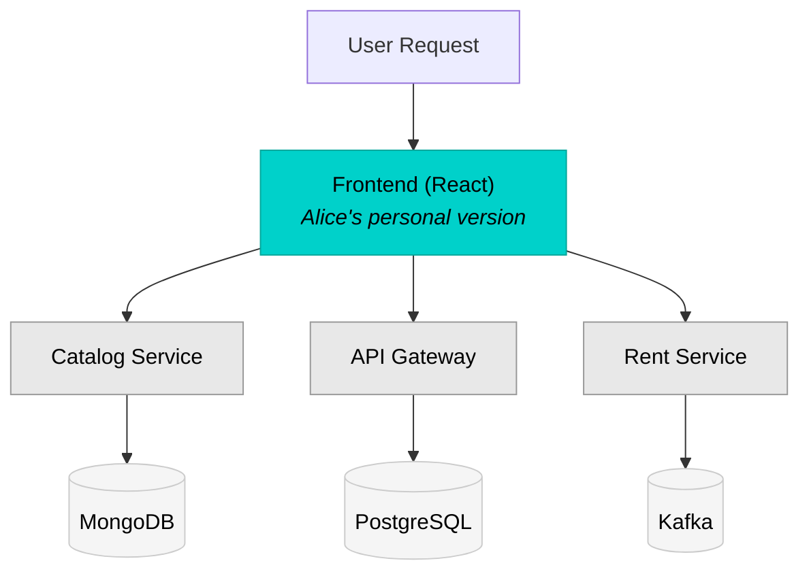

import Image from "@theme/Image";

Divert is Okteto's intelligent traffic routing system that enables developers to work efficiently with subsets of microservice applications. Instead of spinning up complete copies of your entire application stack for each developer, Divert allows you to deploy only the services you're actively modifying while seamlessly connecting to stable, shared versions of everything else.

## What is Divert?

Divert transforms how teams develop microservices by making selective service deployment both practical and transparent to your application code. With Divert, you can:

- **Deploy only what you change**: Work on 1-2 services instead of managing 20+
- **Get shareable preview URLs**: Receive real URLs others can access to test your work-in-progress
- **Start developing in seconds**: Skip waiting for databases, message queues, and third-party services to initialize
- **Collaborate without conflicts**: Multiple developers work on different services simultaneously
- **Reduce infrastructure costs**: Share expensive resources like databases and message queues across your team
- **Test against real services**: No more mocks or stubs for services you're not modifying

## How Divert Works

Divert creates lightweight development environments containing only your modified services, then intelligently routes traffic between your services and shared infrastructure based on HTTP headers.

### The Divert Flow

1. A shared environment runs the complete application stack (e.g., in a `staging` namespace)
2. You create a personal Development Environment deploying only the service(s) you're modifying
3. Divert automatically routes traffic:
   - Requests with your namespace header → Your version of the service
   - Requests to services you haven't deployed → Shared versions in the staging namespace
   - Database, queue, and external service calls → Shared infrastructure
4. Your application works normally, unaware it's communicating with services across namespaces

### Traffic Routing Mechanism

Divert uses the W3C Trace Context standard `baggage` header for routing decisions:

```
baggage: okteto-divert=alice-feature
```

This header:

- Routes traffic to your diverted services when they exist
- Falls back to shared services automatically
- Propagates through your entire application call chain when properly instrumented

### Architecture Example

Consider a Movies application with multiple microservices. Alice is working on the frontend and only needs to deploy that service:



**Key Points:**
- **Alice's services** (teal): Only the Frontend is deployed in her namespace
- **Shared services** (gray): Catalog, API Gateway, and Rent Service run in staging
- **Shared infrastructure** (gray): Databases and message queues run in staging

Alice doesn't need to deploy or manage the catalog service, rent service, API gateway, MongoDB, PostgreSQL, or Kafka. Divert handles all the routing transparently.

## Divert Drivers

Okteto supports two implementations of Divert to accommodate different infrastructure setups:

| Driver | Use Case | Requirements |
|--------|----------|--------------|
| **nginx** (default) | Standard Okteto installations | Uses Okteto's built-in nginx ingress with optional Linkerd for service mesh |
| **istio** | Environments with existing Istio service mesh | Requires Istio installation |

Both drivers provide the same developer experience and use the same `okteto.yaml` configuration. The difference is in the underlying routing technology.

:::info
Both drivers now use the same baggage header format: `baggage: okteto-divert=<namespace>`. This was unified in Okteto 1.31+ for consistency.
:::

### Driver Selection Guide

**Choose nginx driver (default) when:**
- Using standard Okteto installation
- You want the simplest setup
- Optional: You can add Linkerd for advanced service mesh features

**Choose istio driver when:**
- Your cluster already has Istio installed
- You prefer Istio's VirtualService-based routing
- Your team is familiar with Istio configuration

:::tip
**Istio vs Linkerd**: These serve different purposes. **Istio is a divert driver** (alternative to nginx), while **Linkerd enhances the nginx driver** (optional add-on). You cannot use both Istio driver and Linkerd together. See the [admin configuration guide](self-hosted/install/divert/index.mdx) for details.
:::

## What Services Should Be Shared?

Divert works best when you share stable, resource-intensive services that developers rarely modify directly.

### Commonly Shared Services

| Service Type | Why Share It | Examples |
|--------------|--------------|----------|
| **Databases** | Expensive, slow to initialize, stable schemas | PostgreSQL, MongoDB, Redis, MySQL |
| **Message Queues** | Complex setup, shared infrastructure | Kafka, RabbitMQ, SQS, Redis Pub/Sub |
| **Third-party APIs** | External dependencies, no local version | Payment gateways, auth providers, email services |
| **Legacy Services** | Rarely modified, complex to run | Mainframe connectors, monoliths |
| **ML/AI Models** | Resource-intensive, stable interfaces | Recommendation engines, NLP services |
| **Object Storage** | Shared test data, binary assets | S3, MinIO, Azure Blob Storage |

## Real Team Scenario

Consider a team working on the Movies application:

| Developer | Task | Diverted Services | Shared Services |
|-----------|------|-------------------|-----------------|
| **Alice** | New UI for movie cards | frontend | catalog, api, rent, worker, all databases |
| **Bob** | Add discount logic | rent, worker | frontend, catalog, api, all databases |
| **Carla** | Rental history API | api | frontend, catalog, rent, worker, all databases |
| **David** | Performance testing | catalog | frontend, api, rent, worker, all databases |

All four developers work simultaneously without conflicts:

- They share expensive infrastructure (databases, Kafka)
- Each has isolated versions of services they're modifying
- Changes don't affect other developers
- Testing happens against real services, not mocks

## Resource Comparison

### Without Divert (per developer)

- 5+ application services
- 3+ databases/queues
- ~4GB RAM and 2 CPU cores minimum
- 5-10 minutes to spin up everything
- Full infrastructure cost per person

### With Divert (per developer)

- 1-2 services they're actually modifying
- ~500MB RAM and 0.5 CPU cores
- 10-30 seconds to start developing
- Access to real shared data and services
- **~80% reduction in infrastructure costs**

## Header Propagation Requirement

For Divert to work across service boundaries, your services must propagate the `baggage` header to downstream calls. This ensures that when Service A calls Service B, the routing header travels with the request.

### Propagation Pattern

```
User Request (with baggage header)
    │
    ▼
Frontend (reads header, includes in API calls)
    │
    ▼
API Service (reads header, includes in database/queue calls)
    │
    ▼
Backend Services (reads header, includes in further calls)
```

### Example Implementations

**JavaScript/Node.js:**
```javascript
// Extract from incoming request
const baggage = req.headers['baggage'];

// Include in outgoing requests
fetch('http://catalog-service/api/movies', {
  headers: { 'baggage': baggage }
});
```

**Go:**
```go
// Extract from incoming request
baggage := r.Header.Get("baggage")

// Include in outgoing requests
req, _ := http.NewRequest("GET", "http://catalog-service/api/movies", nil)
req.Header.Set("baggage", baggage)
```

**Java/Spring:**
```java
// Using Spring's WebClient
webClient.get()
    .uri("http://catalog-service/api/movies")
    .header("baggage", baggage)
    .retrieve();
```

:::tip
Beyond HTTP routing, the baggage header can also be used to route messages to different queues/topics, redirect requests to services in other namespaces, and dynamically select database instances. See the [implementation guide](../development/using-divert.mdx) for detailed patterns.
:::

## Next Steps

- **[Using Divert](../development/using-divert.mdx)** - Implementation details, manifest configuration, and code patterns
- **[Divert Tutorial](/docs/tutorials/divert)** - Step-by-step getting started guide
- **[Manifest Reference](../reference/okteto-manifest.mdx#divert)** - Complete configuration options
- **[Self-Hosted Configuration](../self-hosted/install/divert/index.mdx)** - Admin setup for Divert drivers
